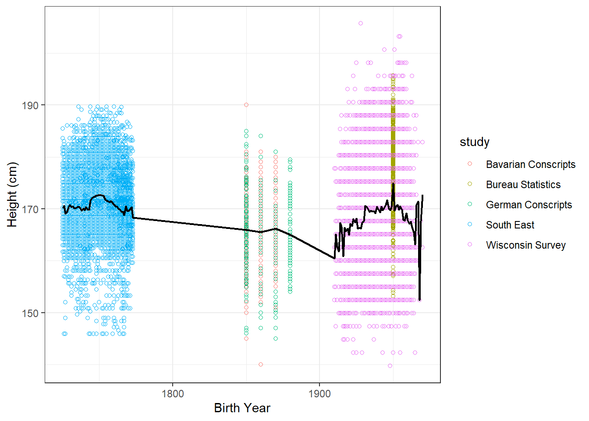

::: {.cell}

```{.r .cell-code}
library(downloader)
```

::: {.cell-output .cell-output-stderr}

```
Warning: package 'downloader' was built under R version 4.4.3
```


:::

```{.r .cell-code}
library(tidyverse)
```

::: {.cell-output .cell-output-stderr}

```
── Attaching core tidyverse packages ──────────────────────── tidyverse 2.0.0 ──
✔ dplyr     1.1.4     ✔ readr     2.1.5
✔ forcats   1.0.0     ✔ stringr   1.5.1
✔ ggplot2   3.5.1     ✔ tibble    3.2.1
✔ lubridate 1.9.3     ✔ tidyr     1.3.1
✔ purrr     1.0.2     
── Conflicts ────────────────────────────────────────── tidyverse_conflicts() ──
✖ dplyr::filter() masks stats::filter()
✖ dplyr::lag()    masks stats::lag()
ℹ Use the conflicted package (<http://conflicted.r-lib.org/>) to force all conflicts to become errors
```


:::

```{.r .cell-code}
library(readxl)
library(haven)
library(foreign)
```

::: {.cell-output .cell-output-stderr}

```
Warning: package 'foreign' was built under R version 4.4.3
```


:::
:::

::: {.cell}

```{.r .cell-code}
german_conscripts <- read_dta("C:/Users/annab/Downloads/R/DS350_SP25_Idell_Anna/week_04/germanconscr.dta")

bavarian_conscripts <- read_dta("C:/Users/annab/Downloads/R/DS350_SP25_Idell_Anna/week_04/germanprison.dta")
```
:::

::: {.cell}

```{.r .cell-code}
temp <- tempfile()
download("https://byuistats.github.io/M335/data/heights/Heights_south-east.zip", dest = temp)
unzip(temp, list = TRUE)
```

::: {.cell-output .cell-output-stdout}

```
       Name  Length                Date
1 B6090.DBF 2519688 1996-08-15 16:23:00
2 b6090.rtf    6873 2002-04-19 14:18:00
```


:::

```{.r .cell-code}
german_soldier <- read.dbf("B6090.DBF")
```
:::

::: {.cell}

```{.r .cell-code}
bureau_data <- read_csv("https://raw.githubusercontent.com/hadley/r4ds/main/data/heights.csv")
```

::: {.cell-output .cell-output-stderr}

```
Rows: 1192 Columns: 6
── Column specification ────────────────────────────────────────────────────────
Delimiter: ","
chr (2): sex, race
dbl (4): earn, height, ed, age

ℹ Use `spec()` to retrieve the full column specification for this data.
ℹ Specify the column types or set `show_col_types = FALSE` to quiet this message.
```


:::

```{.r .cell-code}
wisconsin_data <- read_sav("C:/Users/annab/Downloads/R/DS350_SP25_Idell_Anna/week_04/main05022005.sav")
```
:::

::: {.cell}

```{.r .cell-code}
german <- german_conscripts %>% 
  mutate(height_cm = height) %>% 
  mutate(height_in = (height/2.54)) %>% 
  mutate(birth_year = bdec) %>% 
  mutate(study = "German Conscripts") %>% 
  select(height_in, height_cm, birth_year, study)

bavarian <- bavarian_conscripts %>% 
  mutate(height_cm = height) %>% 
  mutate(height_in = (height/2.54)) %>% 
  mutate(birth_year = bdec) %>% 
  mutate(study = "Bavarian Conscripts") %>% 
  select(height_in, height_cm, birth_year, study)

south_east <- german_soldier %>% 
  mutate(height_cm = CMETER) %>% 
  mutate(height_in = (CMETER/2.54)) %>% 
  mutate(birth_year = GEBJ) %>% 
  mutate(study = "South East") %>% 
  select(height_in, height_cm, birth_year, study)

bureau <- bureau_data %>% 
  mutate(height_cm = (height*2.54)) %>% 
  mutate(height_in = height) %>% 
  mutate(birth_year = as.numeric("1950")) %>% 
  mutate(study = "Bureau Statistics") %>% 
  filter(sex == "male") %>% 
  select(height_in, height_cm, birth_year, study)

wisconsin <- wisconsin_data %>% 
  mutate(height_in = ((RT216F*12) + (RT216I))) %>%  
  mutate(height_cm = (height_in*2.54)) %>%
  filter(height_in <= 81, height_in >= 55) %>% 
  filter(DOBY >= 10) %>% 
  mutate(birth_year = as.numeric(paste("19", DOBY, sep = ""))) %>%
  mutate(study = "Wisconsin Survey") %>% 
  select(height_in, height_cm, birth_year, study)

combined_height <- bind_rows(german, bavarian, south_east, bureau, wisconsin)
```
:::


To tidy up the datasets I mutated the height and birth year columns to have the same column names. I also multiplied or divided height by 2.54 to get measurements in both inches and centimeters, because most datasets only had height listed as one or the other. For the Bureau and Wisconsin datasets I also had to change the birth_year to a numeric variable for the binding function to work. After mutating the columns so that height and birth year were standardized across the datasets, I selected only the necessary columns from each set. For the Bureau data, I also filtered the sex to only include male data. Within the Wisconsin dataset, I decided to filter out heights above 81 inches and below 55 inches, and birth years earlier than 1910, to eliminate any possible outliers or impossible values (like negative birth years).


::: {.cell}

```{.r .cell-code}
ggplot(combined_height, aes(x = birth_year, y = height_cm, colour = study)) + 
  geom_point(pch = 1)+
  stat_summary(fun = mean, geom = "line", size = .75, color = "black") +
  labs(x = "Birth Year", y = "Height (cm)", ) +
  theme_bw()
```

::: {.cell-output .cell-output-stderr}

```
Warning: Using `size` aesthetic for lines was deprecated in ggplot2 3.4.0.
ℹ Please use `linewidth` instead.
```


:::

::: {.cell-output-display}
{width=672}
:::
:::


Compared to the previous data, this combined data from soldiers, bureau statistics, and a university survey tells a different story. The black line, representing the mean height over the years, suggests that human height is staying about the same - around 170cm tall, with a dip in the 1800s. The contradiction of the two sets of data might be explained by the differences in population being surveyed between the two. 

Firstly, a large portion of this data came from conscripts and prisoners in wartime, which historically were comprised of mostly teenage boys and young men, who might still have been growing, or were malnourished during their time in the war. Additionally, the sample from University of Wisconsin is made up of males and females, which is different from the other data, and may lower the mean as men are taller than women on average.

Overall, I would support the claim that human height is increasing over time. Height differs by country generally, and the previous height data comparing the averages of countries over time indicates that height is increasing over time. In the current data, height was recorded among populations from different regions. Differences within these regions may be displaying changes in nutrition or health for those specific regions, rather than a comparison of overall human height developing over time.
