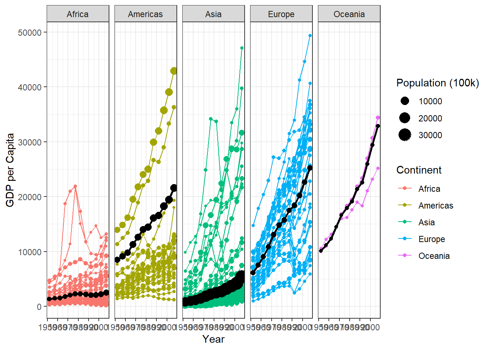

::: {.cell}

```{.r .cell-code}
library(tidyverse)
```

::: {.cell-output .cell-output-stderr}

```
── Attaching core tidyverse packages ──────────────────────── tidyverse 2.0.0 ──
✔ dplyr     1.1.4     ✔ readr     2.1.5
✔ forcats   1.0.0     ✔ stringr   1.5.1
✔ ggplot2   3.5.1     ✔ tibble    3.2.1
✔ lubridate 1.9.3     ✔ tidyr     1.3.1
✔ purrr     1.0.2     
── Conflicts ────────────────────────────────────────── tidyverse_conflicts() ──
✖ dplyr::filter() masks stats::filter()
✖ dplyr::lag()    masks stats::lag()
ℹ Use the conflicted package (<http://conflicted.r-lib.org/>) to force all conflicts to become errors
```


:::

```{.r .cell-code}
library(gapminder)
```

::: {.cell-output .cell-output-stderr}

```
Warning: package 'gapminder' was built under R version 4.4.3
```


:::

```{.r .cell-code}
gapminder2 <- filter(gapminder, country != "Kuwait")
```
:::

::: {.cell}

```{.r .cell-code}
gapminder_weighted <- gapminder2 %>%
  group_by(continent, year) %>%
  summarise(w_gdp = weighted.mean(gdpPercap, w = pop))
```

::: {.cell-output .cell-output-stderr}

```
`summarise()` has grouped output by 'continent'. You can override using the
`.groups` argument.
```


:::

```{.r .cell-code}
gapminder3 <- gapminder2 %>% 
  left_join(gapminder_weighted, by = c("continent", "year"))
```
:::

::: {.cell}

```{.r .cell-code}
ggplot(gapminder3, aes(x = year, y = gdpPercap, color = continent, group = country)) + 
  geom_point(aes(size = pop/4e4)) +
  geom_line() +
  geom_line(data = gapminder3, 
            aes(x = year, y = w_gdp, group = continent), color = "black", linewidth = 1) +
  labs(x = "Year", y = "GDP per Capita", color = "Continent", size = "Population (100k)") +
  geom_point(data = gapminder3, aes(x = year, y = w_gdp, group = continent, size = pop/4e4), color = "black") + 
  facet_wrap(~ continent, nrow = 1, ncol = 5) +
  theme_bw()
```

::: {.cell-output-display}
{width=672}
:::
:::


AI was used for troubleshooting code on this project.
