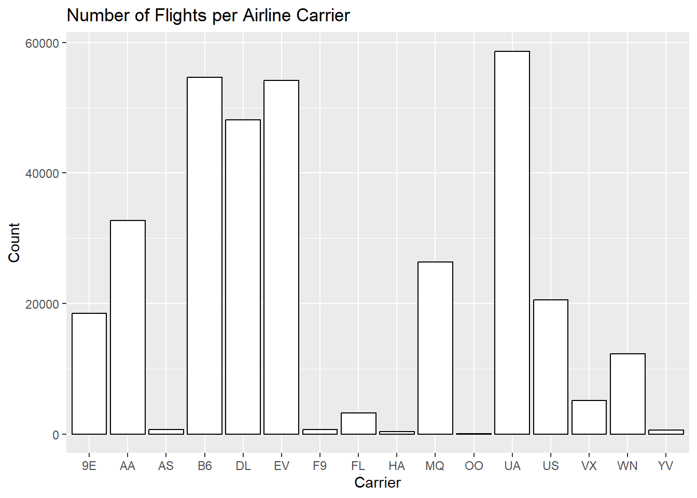
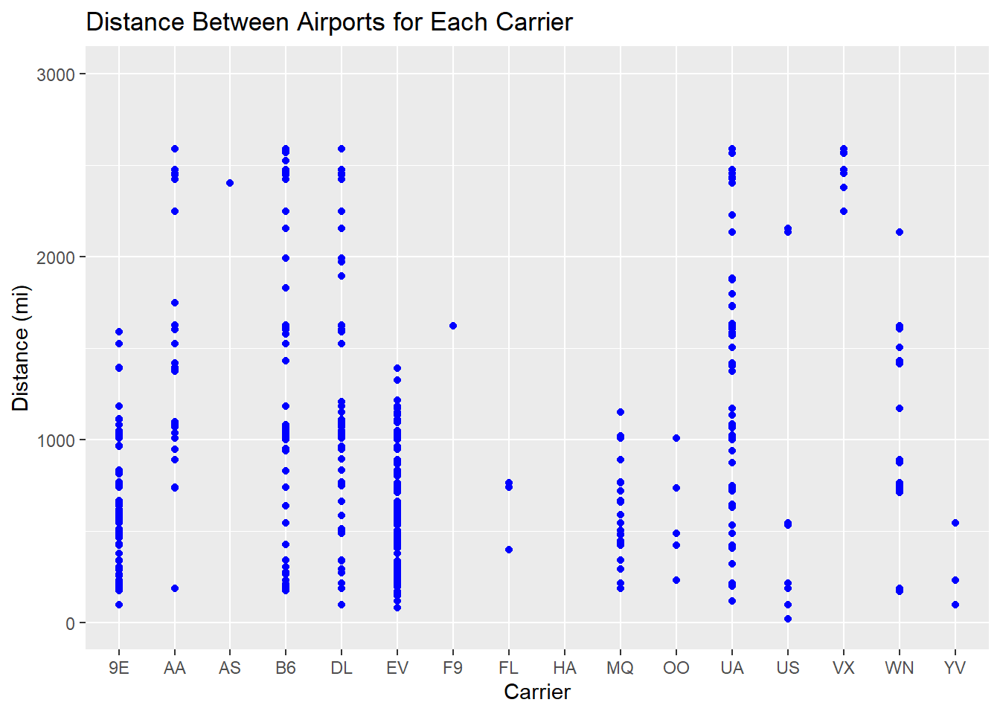

::: cell
``` {.r .cell-code}
library(tidyverse)
```

::: {.cell-output .cell-output-stderr}
```         
── Attaching core tidyverse packages ──────────────────────── tidyverse 2.0.0 ──
✔ dplyr     1.1.4     ✔ readr     2.1.5
✔ forcats   1.0.0     ✔ stringr   1.5.1
✔ ggplot2   3.5.1     ✔ tibble    3.2.1
✔ lubridate 1.9.3     ✔ tidyr     1.3.1
✔ purrr     1.0.2     
── Conflicts ────────────────────────────────────────── tidyverse_conflicts() ──
✖ dplyr::filter() masks stats::filter()
✖ dplyr::lag()    masks stats::lag()
ℹ Use the conflicted package (<http://conflicted.r-lib.org/>) to force all conflicts to become errors
```
:::

``` {.r .cell-code}
library(nycflights13)
```

::: {.cell-output .cell-output-stderr}
```         
Warning: package 'nycflights13' was built under R version 4.4.3
```
:::

``` {.r .cell-code}
ggplot(flights, aes(x = carrier)) +
  geom_bar(fill = "white", color = "black") +
  labs(title = "Number of Flights per Airline Carrier",
       x = "Carrier",
       y = "Count")
```

::: cell-output-display
{width="672"}
:::

``` {.r .cell-code}
ggplot(flights, aes(x = distance)) +
  geom_histogram(fill = "lightblue", color = "black") +
  coord_cartesian(xlim = c(0, 3000)) +
  labs(title = "Frequency of Distances Flown Between Airports",
       x = "Distance (mi)",
       y = "Frequency")
```

::: {.cell-output .cell-output-stderr}
```         
`stat_bin()` using `bins = 30`. Pick better value with `binwidth`.
```
:::

::: cell-output-display
{width="672"}
:::

``` {.r .cell-code}
ggplot(flights, aes(x = carrier, y = distance)) +
  geom_point(color = "blue", pch = 19) +
  coord_cartesian(ylim = c(0, 3000)) +
  labs(title = "Distance Between Airports for Each Carrier",
       x = "Carrier",
       y = "Distance (mi)")
```

::: cell-output-display
{width="672"}
:::
:::

I investigated the relationship between carrier and distance, and wanted to know if some carriers were more likely to travel longer or shorter distances than others. I chose to use a bar chart to create a visual for carrier because carrier is a discrete variable, and I changed the color to make it more visually appealing and to differentiate it from the distance histogram. I made a histogram to represent distance because there are a lot of points, and I wanted to illustrate the frequency of how many times a distance was flown. I adjusted the limits of the x-axis to cut out the outliers and get a better visual of the most frequenct distances flown, and I changed the color to be more visually appealing.

My visual representing the relationship between the two variables is a scatterplot, although it looks more like a dot plot. I adjusted the limits of the y-axis to zoom in on the points, and I colored the dots and chose a pch to make the points more visible. The scatterplot of the two variables mimics the bar chart of the carriers, suggesting that the more flights a carrier takes, the more it is to have longer distance flights available. Carriers like FL, OO, and YV had very few flights, and they also traveled significantly shorter distances than many of the other carriers. Additionally, a comparison of the histogram and the scatterplot show that most flights are shorter distances 1300 miles or only a handful of the carriers travel more than 2200 miles.
