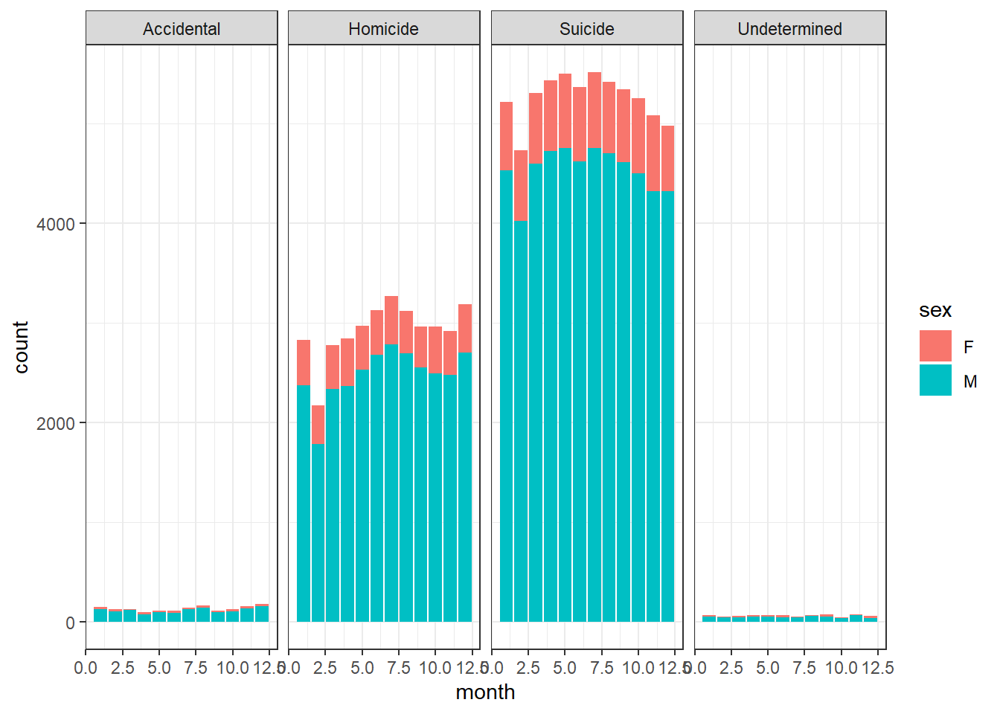

::: {.cell}

```{.r .cell-code}
library(tidyverse)
```

::: {.cell-output .cell-output-stderr}

```
── Attaching core tidyverse packages ──────────────────────── tidyverse 2.0.0 ──
✔ dplyr     1.1.4     ✔ readr     2.1.5
✔ forcats   1.0.0     ✔ stringr   1.5.1
✔ ggplot2   3.5.1     ✔ tibble    3.2.1
✔ lubridate 1.9.3     ✔ tidyr     1.3.1
✔ purrr     1.0.2     
── Conflicts ────────────────────────────────────────── tidyverse_conflicts() ──
✖ dplyr::filter() masks stats::filter()
✖ dplyr::lag()    masks stats::lag()
ℹ Use the conflicted package (<http://conflicted.r-lib.org/>) to force all conflicts to become errors
```


:::

```{.r .cell-code}
gundeaths <- read.csv("C:/Users/annab/Downloads/R/DS350_SP25_Idell_Anna/full_data.csv")
```
:::


FiveThirtyEight has compiled data on annual gun deaths, exploring the causes for the purpose of finding solutions to reduce gun deaths each year. All data included is from 2012 - 2014, and records age, sex, location, level of education, and race, among others. Homicides are defined as deaths caused by assault or legal intervention, mass shootings indicate that three or more people were killed, and other categories are listed shootings of police officers and terrorism gun deaths. Only data for the deaths of U.S. residents was included.


::: {.cell}

```{.r .cell-code}
gundeaths2 <- gundeaths %>% 
  mutate(season = case_when(
    month %in% c(12, 1, 2) ~ "Winter",
    month %in% c(3, 4, 5) ~ "Spring",
    month %in% c(6, 7, 8) ~ "Summer",
    month %in% c(9, 10, 11) ~ "Fall")) %>% 
    filter(!is.na(intent)) 
```
:::

::: {.cell}

```{.r .cell-code}
ggplot(gundeaths2, aes(x = month, fill = sex)) +
  geom_bar() +
  facet_wrap( ~intent, nrow = 1, ncol = 4) +
  theme_bw()
```

::: {.cell-output-display}
{width=672}
:::
:::
