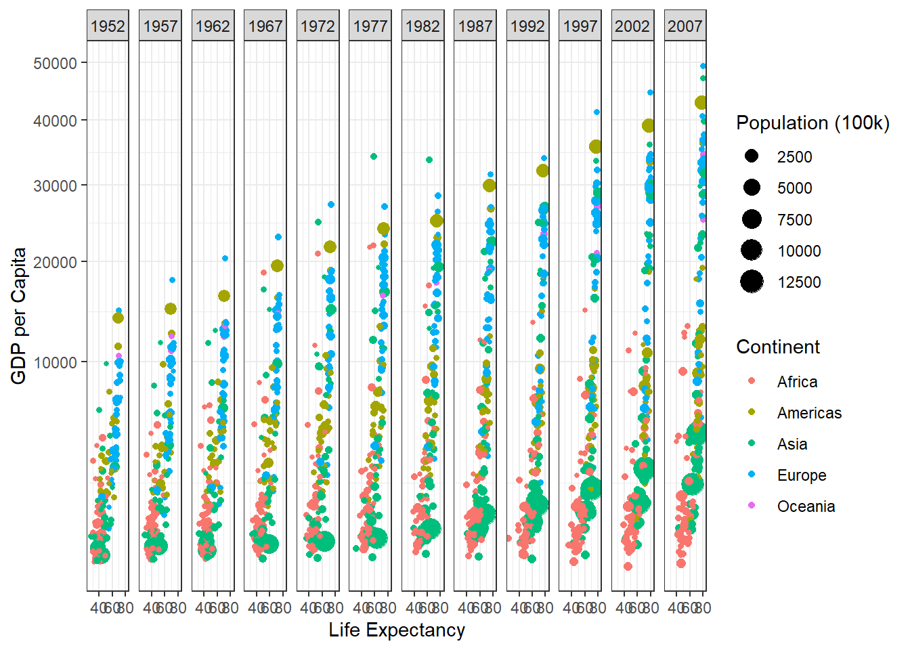

::: {.cell}

```{.r .cell-code}
library(gapminder)
```

::: {.cell-output .cell-output-stderr}

```
Warning: package 'gapminder' was built under R version 4.4.3
```


:::

```{.r .cell-code}
library(tidyverse)
```

::: {.cell-output .cell-output-stderr}

```
── Attaching core tidyverse packages ──────────────────────── tidyverse 2.0.0 ──
✔ dplyr     1.1.4     ✔ readr     2.1.5
✔ forcats   1.0.0     ✔ stringr   1.5.1
✔ ggplot2   3.5.1     ✔ tibble    3.2.1
✔ lubridate 1.9.3     ✔ tidyr     1.3.1
✔ purrr     1.0.2     
── Conflicts ────────────────────────────────────────── tidyverse_conflicts() ──
✖ dplyr::filter() masks stats::filter()
✖ dplyr::lag()    masks stats::lag()
ℹ Use the conflicted package (<http://conflicted.r-lib.org/>) to force all conflicts to become errors
```


:::
:::

::: {.cell}

```{.r .cell-code}
gapminder2 <- filter(gapminder, country != "Kuwait")

View(gapminder2)
```
:::

::: {.cell}

```{.r .cell-code}
ggplot(gapminder2,
       aes(x = lifeExp, y = gdpPercap, size = pop/1e5)) +
  geom_point(aes(color = continent)) +
  labs(x = "Life Expectancy",
       y = "GDP per Capita",
       color = "Continent",
       size = "Population (100k)",
       ) +
  scale_y_continuous(trans = "sqrt") +
  facet_wrap(~ year, nrow = 1, ncol = 12) +
  theme_bw()
```

::: {.cell-output-display}
{width=672}
:::
:::