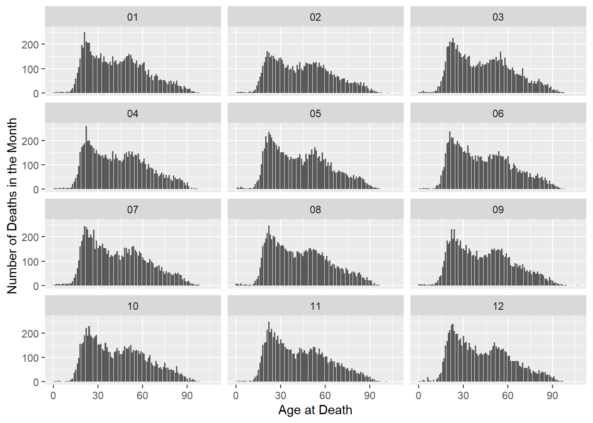

::: {.cell}

```{.r .cell-code}
library(tidyverse)
```

::: {.cell-output .cell-output-stderr}

```
── Attaching core tidyverse packages ──────────────────────── tidyverse 2.0.0 ──
✔ dplyr     1.1.4     ✔ readr     2.1.5
✔ forcats   1.0.0     ✔ stringr   1.5.1
✔ ggplot2   3.5.1     ✔ tibble    3.2.1
✔ lubridate 1.9.3     ✔ tidyr     1.3.1
✔ purrr     1.0.2     
── Conflicts ────────────────────────────────────────── tidyverse_conflicts() ──
✖ dplyr::filter() masks stats::filter()
✖ dplyr::lag()    masks stats::lag()
ℹ Use the conflicted package (<http://conflicted.r-lib.org/>) to force all conflicts to become errors
```


:::

```{.r .cell-code}
gundeaths <- read_csv("C:/Users/annab/Downloads/R/DS350_SP25_Idell_Anna/week_03/full_data.csv")
```

::: {.cell-output .cell-output-stderr}

```
New names:
Rows: 100798 Columns: 11
── Column specification
──────────────────────────────────────────────────────── Delimiter: "," chr
(6): month, intent, sex, race, place, education dbl (5): ...1, year, police,
age, hispanic
ℹ Use `spec()` to retrieve the full column specification for this data. ℹ
Specify the column types or set `show_col_types = FALSE` to quiet this message.
• `` -> `...1`
```


:::
:::


FiveThirtyEight has compiled data on annual gun deaths, exploring the causes for the purpose of finding solutions to reduce gun deaths each year. All data included is from 2012 - 2014, and records age, sex, location, level of education, and race, among others. Homicides are defined as deaths caused by assault or legal intervention, mass shootings indicate that three or more people were killed, and other categories are listed shootings of police officers and terrorism gun deaths. Only data for the deaths of U.S. residents was included.


::: {.cell}

```{.r .cell-code}
gundeaths2 <- gundeaths %>%
  mutate(month2 = as.numeric(month)) %>% 
  mutate(season = case_when(
    month2 %in% c(12, 1, 2) ~ "Winter",
    month2 %in% c(3, 4, 5) ~ "Spring",
    month2 %in% c(6, 7, 8) ~ "Summer",
    month2 %in% c(9, 10, 11) ~ "Fall")) %>% 
  filter(!is.na(intent))
```
:::

::: {.cell}

```{.r .cell-code}
ggplot(gundeaths2, aes(x = intent)) +
  geom_bar() +
  facet_wrap( ~season, nrow = 4, ncol = 1) +
  labs(x = "Intent", y = "Amount per Season") +
  coord_flip() +
  theme_bw()
```

::: {.cell-output-display}
{width=672}
:::

```{.r .cell-code}
ggplot(gundeaths2, aes(x = age)) +
  geom_bar() +
  facet_wrap(~month, nrow = 4, ncol = 3) +
  labs(x = "Age at Death", y = "Number of Deaths in the Month")
```

::: {.cell-output .cell-output-stderr}

```
Warning: Removed 18 rows containing non-finite outside the scale range
(`stat_count()`).
```


:::

::: {.cell-output-display}
{width=672}
:::

```{.r .cell-code}
  theme_bw()
```

::: {.cell-output .cell-output-stdout}

```
List of 136
 $ line                            :List of 6
  ..$ colour       : chr "black"
  ..$ linewidth    : num 0.5
  ..$ linetype     : num 1
  ..$ lineend      : chr "butt"
  ..$ arrow        : logi FALSE
  ..$ inherit.blank: logi TRUE
  ..- attr(*, "class")= chr [1:2] "element_line" "element"
 $ rect                            :List of 5
  ..$ fill         : chr "white"
  ..$ colour       : chr "black"
  ..$ linewidth    : num 0.5
  ..$ linetype     : num 1
  ..$ inherit.blank: logi TRUE
  ..- attr(*, "class")= chr [1:2] "element_rect" "element"
 $ text                            :List of 11
  ..$ family       : chr ""
  ..$ face         : chr "plain"
  ..$ colour       : chr "black"
  ..$ size         : num 11
  ..$ hjust        : num 0.5
  ..$ vjust        : num 0.5
  ..$ angle        : num 0
  ..$ lineheight   : num 0.9
  ..$ margin       : 'margin' num [1:4] 0points 0points 0points 0points
  .. ..- attr(*, "unit")= int 8
  ..$ debug        : logi FALSE
  ..$ inherit.blank: logi TRUE
  ..- attr(*, "class")= chr [1:2] "element_text" "element"
 $ title                           : NULL
 $ aspect.ratio                    : NULL
 $ axis.title                      : NULL
 $ axis.title.x                    :List of 11
  ..$ family       : NULL
  ..$ face         : NULL
  ..$ colour       : NULL
  ..$ size         : NULL
  ..$ hjust        : NULL
  ..$ vjust        : num 1
  ..$ angle        : NULL
  ..$ lineheight   : NULL
  ..$ margin       : 'margin' num [1:4] 2.75points 0points 0points 0points
  .. ..- attr(*, "unit")= int 8
  ..$ debug        : NULL
  ..$ inherit.blank: logi TRUE
  ..- attr(*, "class")= chr [1:2] "element_text" "element"
 $ axis.title.x.top                :List of 11
  ..$ family       : NULL
  ..$ face         : NULL
  ..$ colour       : NULL
  ..$ size         : NULL
  ..$ hjust        : NULL
  ..$ vjust        : num 0
  ..$ angle        : NULL
  ..$ lineheight   : NULL
  ..$ margin       : 'margin' num [1:4] 0points 0points 2.75points 0points
  .. ..- attr(*, "unit")= int 8
  ..$ debug        : NULL
  ..$ inherit.blank: logi TRUE
  ..- attr(*, "class")= chr [1:2] "element_text" "element"
 $ axis.title.x.bottom             : NULL
 $ axis.title.y                    :List of 11
  ..$ family       : NULL
  ..$ face         : NULL
  ..$ colour       : NULL
  ..$ size         : NULL
  ..$ hjust        : NULL
  ..$ vjust        : num 1
  ..$ angle        : num 90
  ..$ lineheight   : NULL
  ..$ margin       : 'margin' num [1:4] 0points 2.75points 0points 0points
  .. ..- attr(*, "unit")= int 8
  ..$ debug        : NULL
  ..$ inherit.blank: logi TRUE
  ..- attr(*, "class")= chr [1:2] "element_text" "element"
 $ axis.title.y.left               : NULL
 $ axis.title.y.right              :List of 11
  ..$ family       : NULL
  ..$ face         : NULL
  ..$ colour       : NULL
  ..$ size         : NULL
  ..$ hjust        : NULL
  ..$ vjust        : num 1
  ..$ angle        : num -90
  ..$ lineheight   : NULL
  ..$ margin       : 'margin' num [1:4] 0points 0points 0points 2.75points
  .. ..- attr(*, "unit")= int 8
  ..$ debug        : NULL
  ..$ inherit.blank: logi TRUE
  ..- attr(*, "class")= chr [1:2] "element_text" "element"
 $ axis.text                       :List of 11
  ..$ family       : NULL
  ..$ face         : NULL
  ..$ colour       : chr "grey30"
  ..$ size         : 'rel' num 0.8
  ..$ hjust        : NULL
  ..$ vjust        : NULL
  ..$ angle        : NULL
  ..$ lineheight   : NULL
  ..$ margin       : NULL
  ..$ debug        : NULL
  ..$ inherit.blank: logi TRUE
  ..- attr(*, "class")= chr [1:2] "element_text" "element"
 $ axis.text.x                     :List of 11
  ..$ family       : NULL
  ..$ face         : NULL
  ..$ colour       : NULL
  ..$ size         : NULL
  ..$ hjust        : NULL
  ..$ vjust        : num 1
  ..$ angle        : NULL
  ..$ lineheight   : NULL
  ..$ margin       : 'margin' num [1:4] 2.2points 0points 0points 0points
  .. ..- attr(*, "unit")= int 8
  ..$ debug        : NULL
  ..$ inherit.blank: logi TRUE
  ..- attr(*, "class")= chr [1:2] "element_text" "element"
 $ axis.text.x.top                 :List of 11
  ..$ family       : NULL
  ..$ face         : NULL
  ..$ colour       : NULL
  ..$ size         : NULL
  ..$ hjust        : NULL
  ..$ vjust        : num 0
  ..$ angle        : NULL
  ..$ lineheight   : NULL
  ..$ margin       : 'margin' num [1:4] 0points 0points 2.2points 0points
  .. ..- attr(*, "unit")= int 8
  ..$ debug        : NULL
  ..$ inherit.blank: logi TRUE
  ..- attr(*, "class")= chr [1:2] "element_text" "element"
 $ axis.text.x.bottom              : NULL
 $ axis.text.y                     :List of 11
  ..$ family       : NULL
  ..$ face         : NULL
  ..$ colour       : NULL
  ..$ size         : NULL
  ..$ hjust        : num 1
  ..$ vjust        : NULL
  ..$ angle        : NULL
  ..$ lineheight   : NULL
  ..$ margin       : 'margin' num [1:4] 0points 2.2points 0points 0points
  .. ..- attr(*, "unit")= int 8
  ..$ debug        : NULL
  ..$ inherit.blank: logi TRUE
  ..- attr(*, "class")= chr [1:2] "element_text" "element"
 $ axis.text.y.left                : NULL
 $ axis.text.y.right               :List of 11
  ..$ family       : NULL
  ..$ face         : NULL
  ..$ colour       : NULL
  ..$ size         : NULL
  ..$ hjust        : num 0
  ..$ vjust        : NULL
  ..$ angle        : NULL
  ..$ lineheight   : NULL
  ..$ margin       : 'margin' num [1:4] 0points 0points 0points 2.2points
  .. ..- attr(*, "unit")= int 8
  ..$ debug        : NULL
  ..$ inherit.blank: logi TRUE
  ..- attr(*, "class")= chr [1:2] "element_text" "element"
 $ axis.text.theta                 : NULL
 $ axis.text.r                     :List of 11
  ..$ family       : NULL
  ..$ face         : NULL
  ..$ colour       : NULL
  ..$ size         : NULL
  ..$ hjust        : num 0.5
  ..$ vjust        : NULL
  ..$ angle        : NULL
  ..$ lineheight   : NULL
  ..$ margin       : 'margin' num [1:4] 0points 2.2points 0points 2.2points
  .. ..- attr(*, "unit")= int 8
  ..$ debug        : NULL
  ..$ inherit.blank: logi TRUE
  ..- attr(*, "class")= chr [1:2] "element_text" "element"
 $ axis.ticks                      :List of 6
  ..$ colour       : chr "grey20"
  ..$ linewidth    : NULL
  ..$ linetype     : NULL
  ..$ lineend      : NULL
  ..$ arrow        : logi FALSE
  ..$ inherit.blank: logi TRUE
  ..- attr(*, "class")= chr [1:2] "element_line" "element"
 $ axis.ticks.x                    : NULL
 $ axis.ticks.x.top                : NULL
 $ axis.ticks.x.bottom             : NULL
 $ axis.ticks.y                    : NULL
 $ axis.ticks.y.left               : NULL
 $ axis.ticks.y.right              : NULL
 $ axis.ticks.theta                : NULL
 $ axis.ticks.r                    : NULL
 $ axis.minor.ticks.x.top          : NULL
 $ axis.minor.ticks.x.bottom       : NULL
 $ axis.minor.ticks.y.left         : NULL
 $ axis.minor.ticks.y.right        : NULL
 $ axis.minor.ticks.theta          : NULL
 $ axis.minor.ticks.r              : NULL
 $ axis.ticks.length               : 'simpleUnit' num 2.75points
  ..- attr(*, "unit")= int 8
 $ axis.ticks.length.x             : NULL
 $ axis.ticks.length.x.top         : NULL
 $ axis.ticks.length.x.bottom      : NULL
 $ axis.ticks.length.y             : NULL
 $ axis.ticks.length.y.left        : NULL
 $ axis.ticks.length.y.right       : NULL
 $ axis.ticks.length.theta         : NULL
 $ axis.ticks.length.r             : NULL
 $ axis.minor.ticks.length         : 'rel' num 0.75
 $ axis.minor.ticks.length.x       : NULL
 $ axis.minor.ticks.length.x.top   : NULL
 $ axis.minor.ticks.length.x.bottom: NULL
 $ axis.minor.ticks.length.y       : NULL
 $ axis.minor.ticks.length.y.left  : NULL
 $ axis.minor.ticks.length.y.right : NULL
 $ axis.minor.ticks.length.theta   : NULL
 $ axis.minor.ticks.length.r       : NULL
 $ axis.line                       : list()
  ..- attr(*, "class")= chr [1:2] "element_blank" "element"
 $ axis.line.x                     : NULL
 $ axis.line.x.top                 : NULL
 $ axis.line.x.bottom              : NULL
 $ axis.line.y                     : NULL
 $ axis.line.y.left                : NULL
 $ axis.line.y.right               : NULL
 $ axis.line.theta                 : NULL
 $ axis.line.r                     : NULL
 $ legend.background               :List of 5
  ..$ fill         : NULL
  ..$ colour       : logi NA
  ..$ linewidth    : NULL
  ..$ linetype     : NULL
  ..$ inherit.blank: logi TRUE
  ..- attr(*, "class")= chr [1:2] "element_rect" "element"
 $ legend.margin                   : 'margin' num [1:4] 5.5points 5.5points 5.5points 5.5points
  ..- attr(*, "unit")= int 8
 $ legend.spacing                  : 'simpleUnit' num 11points
  ..- attr(*, "unit")= int 8
 $ legend.spacing.x                : NULL
 $ legend.spacing.y                : NULL
 $ legend.key                      : NULL
 $ legend.key.size                 : 'simpleUnit' num 1.2lines
  ..- attr(*, "unit")= int 3
 $ legend.key.height               : NULL
 $ legend.key.width                : NULL
 $ legend.key.spacing              : 'simpleUnit' num 5.5points
  ..- attr(*, "unit")= int 8
 $ legend.key.spacing.x            : NULL
 $ legend.key.spacing.y            : NULL
 $ legend.frame                    : NULL
 $ legend.ticks                    : NULL
 $ legend.ticks.length             : 'rel' num 0.2
 $ legend.axis.line                : NULL
 $ legend.text                     :List of 11
  ..$ family       : NULL
  ..$ face         : NULL
  ..$ colour       : NULL
  ..$ size         : 'rel' num 0.8
  ..$ hjust        : NULL
  ..$ vjust        : NULL
  ..$ angle        : NULL
  ..$ lineheight   : NULL
  ..$ margin       : NULL
  ..$ debug        : NULL
  ..$ inherit.blank: logi TRUE
  ..- attr(*, "class")= chr [1:2] "element_text" "element"
 $ legend.text.position            : NULL
 $ legend.title                    :List of 11
  ..$ family       : NULL
  ..$ face         : NULL
  ..$ colour       : NULL
  ..$ size         : NULL
  ..$ hjust        : num 0
  ..$ vjust        : NULL
  ..$ angle        : NULL
  ..$ lineheight   : NULL
  ..$ margin       : NULL
  ..$ debug        : NULL
  ..$ inherit.blank: logi TRUE
  ..- attr(*, "class")= chr [1:2] "element_text" "element"
 $ legend.title.position           : NULL
 $ legend.position                 : chr "right"
 $ legend.position.inside          : NULL
 $ legend.direction                : NULL
 $ legend.byrow                    : NULL
 $ legend.justification            : chr "center"
 $ legend.justification.top        : NULL
 $ legend.justification.bottom     : NULL
 $ legend.justification.left       : NULL
 $ legend.justification.right      : NULL
 $ legend.justification.inside     : NULL
 $ legend.location                 : NULL
 $ legend.box                      : NULL
 $ legend.box.just                 : NULL
 $ legend.box.margin               : 'margin' num [1:4] 0cm 0cm 0cm 0cm
  ..- attr(*, "unit")= int 1
 $ legend.box.background           : list()
  ..- attr(*, "class")= chr [1:2] "element_blank" "element"
 $ legend.box.spacing              : 'simpleUnit' num 11points
  ..- attr(*, "unit")= int 8
  [list output truncated]
 - attr(*, "class")= chr [1:2] "theme" "gg"
 - attr(*, "complete")= logi TRUE
 - attr(*, "validate")= logi TRUE
```


:::
:::


The first graph addresses the amount of gun deaths that can be attributed to intent for each season. Consistently, suicide is the leading reason for gun deaths, followed by homicide, and then accident. Interestingly, Summer sees the highest rates of gun deaths for each category except Accident, and Winter sees the lowest amount. 

The second graph addresses the rates of gun deaths by age in each month. The highest spike can be seen in April around the 20s, and the lowest count overall can be found in February. Each month noticeably follows a similar pattern of distribution of age, with some variability for count.
