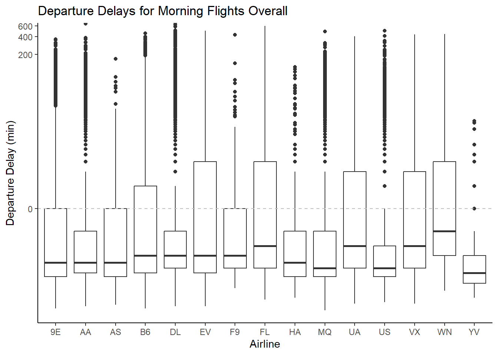
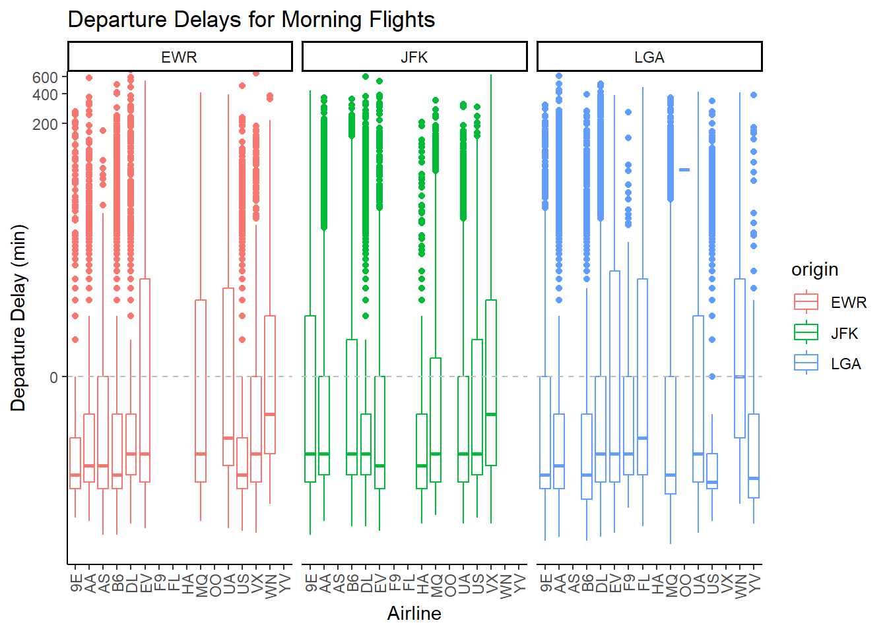
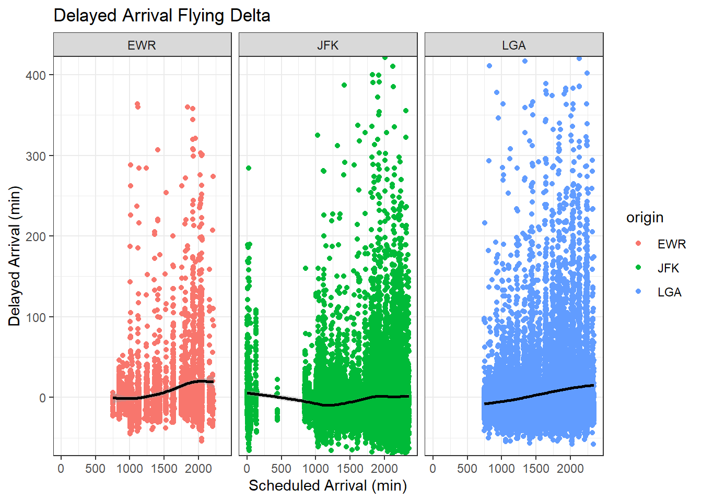
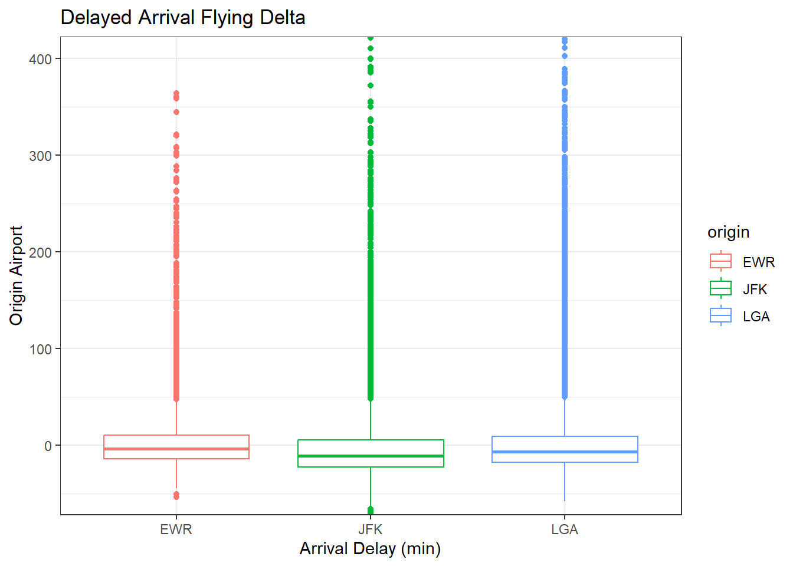

::: {.cell}

```{.r .cell-code}
library(tidyverse)
```

::: {.cell-output .cell-output-stderr}

```
── Attaching core tidyverse packages ──────────────────────── tidyverse 2.0.0 ──
✔ dplyr     1.1.4     ✔ readr     2.1.5
✔ forcats   1.0.0     ✔ stringr   1.5.1
✔ ggplot2   3.5.1     ✔ tibble    3.2.1
✔ lubridate 1.9.3     ✔ tidyr     1.3.1
✔ purrr     1.0.2     
── Conflicts ────────────────────────────────────────── tidyverse_conflicts() ──
✖ dplyr::filter() masks stats::filter()
✖ dplyr::lag()    masks stats::lag()
ℹ Use the conflicted package (<http://conflicted.r-lib.org/>) to force all conflicts to become errors
```


:::

```{.r .cell-code}
library(nycflights13)
```

::: {.cell-output .cell-output-stderr}

```
Warning: package 'nycflights13' was built under R version 4.4.3
```


:::

```{.r .cell-code}
library(scales)
```

::: {.cell-output .cell-output-stderr}

```

Attaching package: 'scales'

The following object is masked from 'package:purrr':

    discard

The following object is masked from 'package:readr':

    col_factor
```


:::
:::

::: {.cell}

```{.r .cell-code}
flights2 <- flights %>%
  filter(dep_time < 1200)

flights3 <- flights %>% 
  filter(carrier == "DL")
```
:::


## For each origin airport (JFK, EWR, LGA), which airline has the lowest 75th percentile of departure delay for flights scheduled to leave earlier than noon?


::: {.cell}

```{.r .cell-code}
ggplot(flights2, aes(x = carrier, y = dep_delay)) +
  geom_boxplot() +
  geom_hline(yintercept = 0, linetype = "dashed", color = "gray") +
  coord_cartesian(ylim = c(-25, 400)) +
  scale_y_continuous(trans = asinh_trans()) +
  labs( title = "Departure Delays for Morning Flights Overall", x = "Airline", y = "Departure Delay (min)") + 
  theme_classic()
```

::: {.cell-output-display}
{width=672}
:::

```{.r .cell-code}
ggplot(flights2, aes(x = carrier, y = dep_delay, color = origin)) +
  geom_boxplot() +
  geom_hline(yintercept = 0, linetype = "dashed", color = "gray") +
  coord_cartesian(ylim = c(-25, 400)) +
  scale_y_continuous(trans = asinh_trans()) +
  labs( title = "Departure Delays for Morning Flights", x = "Airline", y = "Departure Delay (min)") + 
  facet_wrap( ~origin, nrow = 1, ncol = 3) +
  theme_classic()
```

::: {.cell-output-display}
{width=672}
:::
:::


The origin airport with the lowest 75th percentile of flights leaving before noon with delayed departure is YV. Overall, YV flights depart ahead of schedule for the majority of their flights.

However, for each of these airports, the airline carrier with the lowest 75th percentile is different. Departing from EWR airport, 9E, DL, and US are nearly exactly tied for the lowest 75th percentile of delayed departure flights. At JFK ariport, HA and DL are nearly exactly tied for the lowest 75th percentile of delayed departure flights. At LGA, US and YV are tied for the lowest 75th percentile of delayed departure flights. This means that 

## Which origin airport is best to minimize my chances of a late arrival when I am using Delta Airlines?


::: {.cell}

```{.r .cell-code}
ggplot(flights3, aes(x = sched_arr_time, y = arr_delay, color = origin)) +
  geom_point() +
  geom_smooth(color = "black") +
  labs(title = "Delayed Arrival Flying Delta", x = "Scheduled Arrival (min)", y = "Delayed Arrival (min)") +
  coord_cartesian(ylim = c(-50, 400)) +
  facet_wrap( ~ origin, nrow = 1, ncol= 3) +
  theme_bw()
```

::: {.cell-output .cell-output-stderr}

```
`geom_smooth()` using method = 'gam' and formula = 'y ~ s(x, bs = "cs")'
```


:::

::: {.cell-output .cell-output-stderr}

```
Warning: Removed 452 rows containing non-finite outside the scale range
(`stat_smooth()`).
```


:::

::: {.cell-output .cell-output-stderr}

```
Warning: Removed 452 rows containing missing values or values outside the scale range
(`geom_point()`).
```


:::

::: {.cell-output-display}
{width=672}
:::

```{.r .cell-code}
ggplot(flights3, aes(x = origin, y = arr_delay, color = origin)) +
  geom_boxplot() +
  labs(title = "Delayed Arrival Flying Delta", x = "Arrival Delay (min)", y = "Origin Airport") +
  coord_cartesian(ylim = c(-50, 400)) +
  theme_bw()
```

::: {.cell-output .cell-output-stderr}

```
Warning: Removed 452 rows containing non-finite outside the scale range
(`stat_boxplot()`).
```


:::

::: {.cell-output-display}
{width=672}
:::
:::


Looking at the scatterplot, the closer a flight arrives to the scheduled arrival time, the closer the line should be to zero, and below zero indicates that the flight arrived ahead of schedule. Although both JFK and LGA have more flight arrivals delayed than EWR, they also have more flights that arrive early. The volume of flights going through these airports make it difficult to discern which airport less late arrivals. However, when looking at the boxplot, it is easier to see that JFK has a lower median of delayed arrivals, as well as a lower 75th percentile. In other words, flights departing from JFk have a minimized chance of experiencing delayed arrival times in comparison with EWR and LGA.

