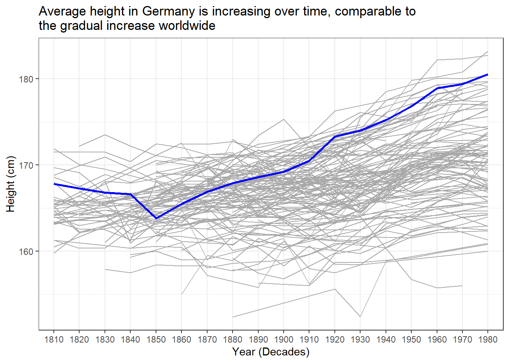

::: {.cell}

```{.r .cell-code}
library(readxl)
library(tidyverse)
```

::: {.cell-output .cell-output-stderr}

```
── Attaching core tidyverse packages ──────────────────────── tidyverse 2.0.0 ──
✔ dplyr     1.1.4     ✔ readr     2.1.5
✔ forcats   1.0.0     ✔ stringr   1.5.1
✔ ggplot2   3.5.1     ✔ tibble    3.2.1
✔ lubridate 1.9.3     ✔ tidyr     1.3.1
✔ purrr     1.0.2     
── Conflicts ────────────────────────────────────────── tidyverse_conflicts() ──
✖ dplyr::filter() masks stats::filter()
✖ dplyr::lag()    masks stats::lag()
ℹ Use the conflicted package (<http://conflicted.r-lib.org/>) to force all conflicts to become errors
```


:::

```{.r .cell-code}
Height <- read_excel("C:/Users/annab/Downloads/R/DS350_SP25_Idell_Anna/week_04/Height.xlsx", skip = 1)
```
:::

::: {.cell}

```{.r .cell-code}
heights2 <- Height %>%
  mutate("country" = `Continent, Region, Country`) %>% 
  select(c(Code, country, "1810", "1820", "1830", "1840")) %>% 
  filter(!is.na(Code) & !is.na(country)) %>%
  filter(country != "Germany") %>% 
  pivot_longer(c('1810', '1820', '1830', '1840'), 
               names_to = "year_decade", 
               values_to = "height_cm") %>% 
  filter(!is.na(height_cm))
```
:::

::: {.cell}

```{.r .cell-code}
ggplot(heights2, aes(x = year_decade, y = height_cm)) +
  geom_jitter(color = "darkgray", pch = 19, size = 2) +
  geom_jitter(data = subset(heights2, country == "Federal Republic of Germany (until 1990)"), color = "blue", pch = 19, size = 2.5) +
  labs(x = "Year (Decades)", y = "Height (cm)") +
  theme_bw()
```

::: {.cell-output-display}
{width=672}
:::
:::


The data displayed features the average heights for countries around the world over four decades. Although a claim has been made that humans are growing taller over time, this data suggests that, at least in the 1800's, humans were growing to shorter heights over time. Highlighted in blue, the Federal Republic of Germany demonstrates a decline in the average height for their population over the course of four decades.This collection of worldwide data can't tell us if human height is increasing in recent decades, but if the trend from this graph continued then humans would likely be getting shorter over time. 

There may be many reasons besides evolution for a slow decline average height over the years. Between 1810 and 1840, some nations experienced wars, illnesses like influenza, and the industrial revolution. These events might have influenced the number of men and women growing to adulthood, and the health of developing children. 
