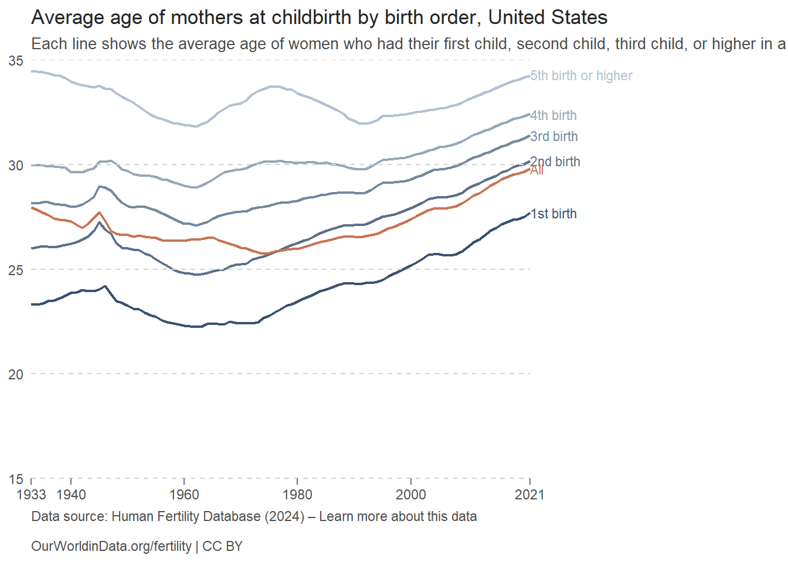

::: {.cell}

```{.r .cell-code}
library(tidyverse)
```

::: {.cell-output .cell-output-stderr}

```
── Attaching core tidyverse packages ──────────────────────── tidyverse 2.0.0 ──
✔ dplyr     1.1.4     ✔ readr     2.1.5
✔ forcats   1.0.0     ✔ stringr   1.5.1
✔ ggplot2   3.5.1     ✔ tibble    3.2.1
✔ lubridate 1.9.3     ✔ tidyr     1.3.1
✔ purrr     1.0.2     
── Conflicts ────────────────────────────────────────── tidyverse_conflicts() ──
✖ dplyr::filter() masks stats::filter()
✖ dplyr::lag()    masks stats::lag()
ℹ Use the conflicted package (<http://conflicted.r-lib.org/>) to force all conflicts to become errors
```


:::

```{.r .cell-code}
library(ggrepel)
```

::: {.cell-output .cell-output-stderr}

```
Warning: package 'ggrepel' was built under R version 4.4.3
```


:::

```{.r .cell-code}
library(ggtext)
```

::: {.cell-output .cell-output-stderr}

```
Warning: package 'ggtext' was built under R version 4.4.3
```


:::
:::

::: {.cell}

```{.r .cell-code}
df <- read_csv("https://ourworldindata.org/grapher/period-average-age-of-mothers-birth-order.csv?v=1&csvType=full&useColumnShortNames=true")
```

::: {.cell-output .cell-output-stderr}

```
Rows: 2605 Columns: 9
── Column specification ────────────────────────────────────────────────────────
Delimiter: ","
chr (2): Entity, Code
dbl (7): Year, mab__birth_order_1, mab__birth_order_2, mab__birth_order_3, m...

ℹ Use `spec()` to retrieve the full column specification for this data.
ℹ Specify the column types or set `show_col_types = FALSE` to quiet this message.
```


:::

```{.r .cell-code}
childbirth <- df %>% 
  filter(Entity == "United States") %>% 
  pivot_longer(cols = starts_with("mab"),
               names_to = "BirthOrder",
               values_to = "Age")

yline <- tibble(x = 1933, xend = 2021, y = seq(15, 35, 5))
```
:::


## Average Age of Mothers at Childbirth (US)


::: {.cell}

```{.r .cell-code}
ggplot(childbirth, aes(x = Year, y = Age, group = BirthOrder, color = BirthOrder)) +
  geom_line(size = .75) +
  scale_y_continuous(breaks = seq(15, 35, 5),
                     limits = c(15, 35),
                     expand = expansion(mult = c(0, 0))) +
  scale_x_continuous(breaks = c(1933, seq(1940, 2000, 20), 2021),
                     limits = c(1933, 2021),
                     expand = expansion(mult = c(0, 0.5))) +
  labs(title = "Average age of mothers at childbirth by birth order, United States", 
       subtitle = "Each line shows the average age of women who had their first child, second child, third child, or higher in a given year.",
       x = NULL,
       y = NULL,
       caption = "Data source: Human Fertility Database (2024) – Learn more about this data
\nOurWorldinData.org/fertility | CC BY") +
  theme_minimal() +
  theme(plot.title = element_text(color = "gray15"),
        plot.subtitle = element_text(size = 10, color = "gray30"),
        plot.caption = element_text(color = "gray30", hjust = 0),
        panel.grid = element_blank(),
        axis.title = element_blank(),
        legend.position = "none",
        axis.ticks.x = element_line(color = "gray45"),
        axis.ticks.length.x = unit(4, "points")) +
  scale_color_manual(values = c("#395270", "#5b708b", "#7489a0", "#96a7ba", "#b2c1d3", "#c97353")) +
  annotate(geom = "text", x = 2021, y = 27.7, label = "1st birth", hjust = 0, color = "#395270", size = 3) +
  annotate(geom = "text", x = 2021, y = 30.2, label = "2nd birth", hjust = 0, color = "#5b708b", size = 3) +
  annotate(geom = "text", x = 2021, y = 31.4, label = "3rd birth", hjust = 0, color = "#7489a0", size = 3) +
  annotate(geom = "text", x = 2021, y = 32.4, label = "4th birth", hjust = 0, color = "#96a7ba", size = 3) +
  annotate(geom = "text", x = 2021, y = 34.3, label = "5th birth or higher", hjust = 0, color = "#b2c1d3", size = 3) +
  annotate(geom = "text", x = 2021, y = 29.8, label = "All", hjust = 0, color = "#c97353", size = 3) +
  geom_segment(data = yline, aes(x = x, xend = xend, y = y, yend = y), color = "lightgray", lty = 2, inherit.aes = FALSE)
```

::: {.cell-output .cell-output-stderr}

```
Warning: Using `size` aesthetic for lines was deprecated in ggplot2 3.4.0.
ℹ Please use `linewidth` instead.
```


:::

::: {.cell-output-display}
{width=672}
:::
:::


I chose to use Gemini and ChatGPT AI to assist me with this assignment by locating bugs that I was having trouble finding, troubleshooting functions that weren't working like I thought they would, and learning new ways to accomplish something when I couldn't find it in the textbook. I chose to use both of them because sometimes they are not reliable and I like to fact check what I am given, and also because I was able to get specific feedback for my unique needs. It affected my learning by showing me new ways to do things, and also explaining why my code worked for other projects but not this one. For example, I was having trouble getting the tick marks on the x axis to touch y = 15, although it worked during the code along, and I was able to get an explanation of the differences between what I was doing vs. trying to do.
