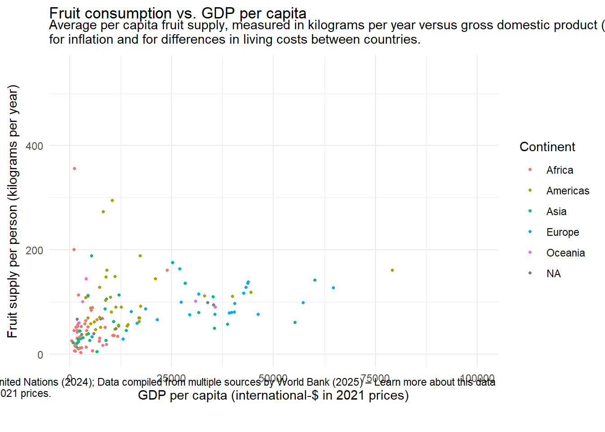

::: {.cell}

```{.r .cell-code}
library(tidyverse)
```

::: {.cell-output .cell-output-stderr}

```
── Attaching core tidyverse packages ──────────────────────── tidyverse 2.0.0 ──
✔ dplyr     1.1.4     ✔ readr     2.1.5
✔ forcats   1.0.0     ✔ stringr   1.5.1
✔ ggplot2   3.5.1     ✔ tibble    3.2.1
✔ lubridate 1.9.3     ✔ tidyr     1.3.1
✔ purrr     1.0.2     
── Conflicts ────────────────────────────────────────── tidyverse_conflicts() ──
✖ dplyr::filter() masks stats::filter()
✖ dplyr::lag()    masks stats::lag()
ℹ Use the conflicted package (<http://conflicted.r-lib.org/>) to force all conflicts to become errors
```


:::

```{.r .cell-code}
library(countrycode)
```

::: {.cell-output .cell-output-stderr}

```
Warning: package 'countrycode' was built under R version 4.4.3
```


:::

```{.r .cell-code}
library(ggplot2)
library(ggrepel)
```

::: {.cell-output .cell-output-stderr}

```
Warning: package 'ggrepel' was built under R version 4.4.3
```


:::

```{.r .cell-code}
library(gganimate)
```

::: {.cell-output .cell-output-stderr}

```
Warning: package 'gganimate' was built under R version 4.4.3
```


:::

```{.r .cell-code}
library(av)
```

::: {.cell-output .cell-output-stderr}

```
Warning: package 'av' was built under R version 4.4.3
```


:::

```{.r .cell-code}
library(gifski)
```

::: {.cell-output .cell-output-stderr}

```
Warning: package 'gifski' was built under R version 4.4.3
```


:::
:::

::: {.cell}

```{.r .cell-code}
df_fruit <- read_csv("https://ourworldindata.org/grapher/fruit-consumption-vs-gdp-per-capita.csv?v=1&csvType=full&useColumnShortNames=true")
```

::: {.cell-output .cell-output-stderr}

```
Rows: 14355 Columns: 6
── Column specification ────────────────────────────────────────────────────────
Delimiter: ","
chr (3): Entity, Code, owid_region
dbl (3): Year, fruit__00002919__food_available_for_consumption__0645pc__kilo...

ℹ Use `spec()` to retrieve the full column specification for this data.
ℹ Specify the column types or set `show_col_types = FALSE` to quiet this message.
```


:::
:::

::: {.cell}

```{.r .cell-code}
fruit <- df_fruit %>%
  mutate(Continent = countrycode(Entity, origin = "country.name", destination = "continent")) %>% 
  filter(!is.na(ny_gdp_pcap_pp_kd)) %>%
  rename("fruit_supply" = fruit__00002919__food_available_for_consumption__0645pc__kilograms_per_year_per_capita) %>%
  filter(!is.na(fruit_supply))
```

::: {.cell-output .cell-output-stderr}

```
Warning: There was 1 warning in `mutate()`.
ℹ In argument: `Continent = countrycode(Entity, origin = "country.name",
  destination = "continent")`.
Caused by warning:
! Some values were not matched unambiguously: Africa, Africa (FAO), Americas (FAO), Asia, Asia (FAO), Austria-Hungary, Belgium-Luxembourg (FAO), British Indian Ocean Territory, Caribbean (FAO), Central America (FAO), Central Asia (FAO), Cocos Islands, Czechoslovakia, Duchy of Modena and Reggio, Duchy of Parma and Piacenza, East Asia and Pacific (WB), East Germany, Eastern Africa (FAO), Eastern Asia (FAO), Eastern Europe (FAO), Europe, Europe (FAO), Europe and Central Asia (WB), European Union (27), European Union (27) (FAO), Federal Republic of Central America, Grand Duchy of Baden, Grand Duchy of Tuscany, High-income countries, Kingdom of Bavaria, Kingdom of Sardinia, Kingdom of Saxony, Kingdom of the Two Sicilies, Kingdom of Wurttemberg, Kosovo, Land Locked Developing Countries (FAO), Latin America and Caribbean (WB), Least Developed Countries (FAO), Low-income countries, Low Income Food Deficit Countries (FAO), Lower-middle-income countries, Micronesia (country), Micronesia (FAO), Middle-income countries, Middle Africa (FAO), Middle East and North Africa (WB), Net Food Importing Developing Countries (FAO), North America, North America (WB), Northern Africa (FAO), Northern America (FAO), Northern Europe (FAO), Oceania, Oceania (FAO), Orange Free State, Serbia and Montenegro, Small Island Developing States (FAO), South-eastern Asia (FAO), South America, South America (FAO), South Asia (WB), South Georgia and the South Sandwich Islands, Southern Africa (FAO), Southern Asia (FAO), Southern Europe (FAO), Sub-Saharan Africa (WB), Upper-middle-income countries, Western Africa (FAO), Western Asia (FAO), Western Europe (FAO), World, Yemen Arab Republic, Yemen People's Republic, Yugoslavia
```


:::
:::


## Fruit consumption vs. GDP per capita


::: {.cell}

```{.r .cell-code}
ggplot(fruit, aes(x = ny_gdp_pcap_pp_kd, y = fruit_supply, color = Continent)) +
  geom_point(pch = 20) +
  transition_states(Year) +
  labs(title = "Fruit consumption vs. GDP per capita",
       subtitle = "Average per capita fruit supply, measured in kilograms per year versus gross domestic product (GDP) per capita, adjusted \nfor inflation and for differences in living costs between countries.",
       x = "GDP per capita (international-$ in 2021 prices)", 
       y = "Fruit supply per person (kilograms per year)",
       caption = "Data source: Food and Agriculture Organization of the United Nations (2024); Data compiled from multiple sources by World Bank (2025) – Learn more about this data \nNote: GDP per capita is expressed in international-$ at 2021 prices.
\nOurWorldinData.org/diet-compositions | CC BY") +
  coord_cartesian(xlim = c(0, 100000)) +
  theme_minimal()
```

::: {.cell-output-display}

:::
:::


## Kenya, Ghana, and the United States


::: {.cell}

```{.r .cell-code}
specific <- fruit %>% 
  filter(Entity %in% c("Kenya", "Ghana", "United States"))

ggplot(fruit, aes(x = ny_gdp_pcap_pp_kd, y = fruit_supply, color = Continent)) +
  geom_point() +
  geom_point(data = specific, aes(x = ny_gdp_pcap_pp_kd, y = fruit_supply), pch = 21, size = 2, color = "black") +
  labs(title = "Fruit consumption vs. GDP per capita: Kenya, Ghana, United States",
       subtitle = "Average per capita fruit supply, measured in kilograms per year versus gross domestic product (GDP) per capita, adjusted \nfor inflation and for differences in living costs between countries.",
       x = "GDP per capita (international-$ in 2021 prices)", 
       y = "Fruit supply per person (kilograms per year)",
       caption = "Data source: Food and Agriculture Organization of the United Nations (2024); Data compiled from multiple sources by World Bank (2025) – Learn more about this data \nNote: GDP per capita is expressed in international-$ at 2021 prices.
\nOurWorldinData.org/diet-compositions | CC BY") +
  coord_cartesian(xlim = c(0, 100000)) +
  theme_minimal()
```

::: {.cell-output-display}
{width=672}
:::
:::


## Oceania


::: {.cell}

```{.r .cell-code}
specific2 <- fruit %>% 
  filter(Continent == "Oceania")

ggplot(fruit, aes(x = ny_gdp_pcap_pp_kd, y = fruit_supply, color = Continent)) +
  geom_point() +
  geom_point(data = specific2, aes(x = ny_gdp_pcap_pp_kd, y = fruit_supply), pch = 21, size = 2, color = "black") +
  labs(title = "Fruit consumption vs. GDP per capita: Oceania",
       subtitle = "Average per capita fruit supply, measured in kilograms per year versus gross domestic product (GDP) per capita, adjusted \nfor inflation and for differences in living costs between countries.",
       x = "GDP per capita (international-$ in 2021 prices)", 
       y = "Fruit supply per person (kilograms per year)",
       caption = "Data source: Food and Agriculture Organization of the United Nations (2024); Data compiled from multiple sources by World Bank (2025) – Learn more about this data \nNote: GDP per capita is expressed in international-$ at 2021 prices.
\nOurWorldinData.org/diet-compositions | CC BY") +
  coord_cartesian(xlim = c(0, 100000)) +
  theme_minimal()
```

::: {.cell-output-display}
{width=672}
:::
:::


This was a challenging assignment, and I still feel that I could've done better with more time. I discovered that the chart looks very different when using a linear vs. logarithmic scale, because the website default is logarithmic but the linear model matches mine much closer. I also realized I am not confident in using axis, plot, and legend aspects to polish a graph. However, I did learn how to create a moving graph that tells the story over time, although it did not match the visual perfectly, and this was exciting and helped the graph tell a better story. Emphasizing different aspects of data also draws the eyes and highlights patterns and gives more meaning to the data. I used layering to highlight certain points, as well as ssize adjustments and color contrast. 
