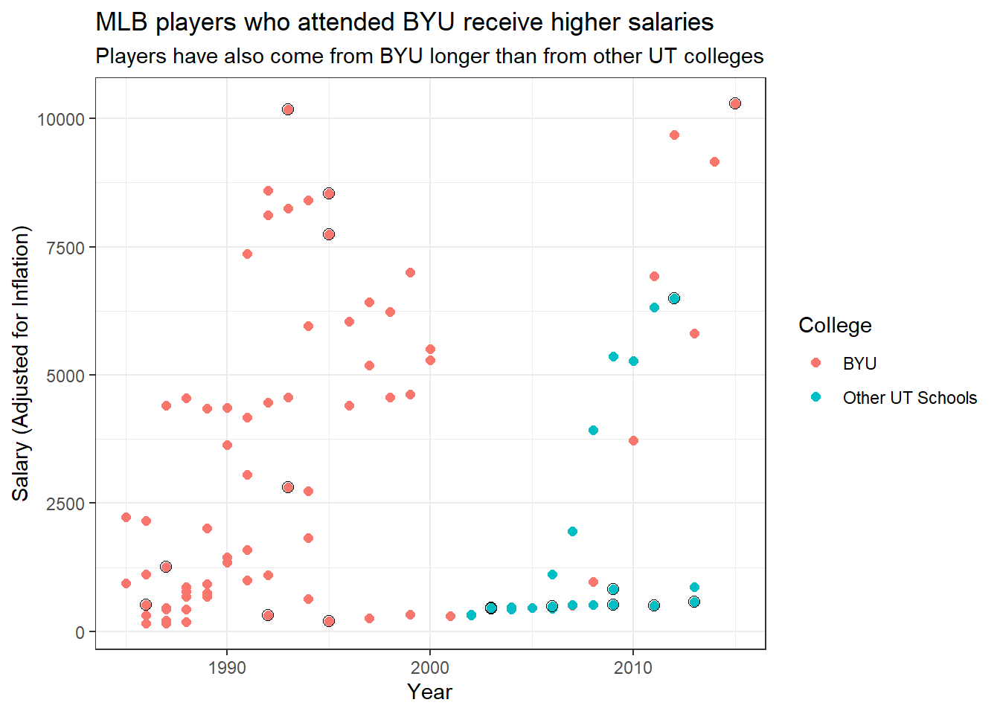

::: {.cell}

```{.r .cell-code}
library(tidyverse)
```

::: {.cell-output .cell-output-stderr}

```
── Attaching core tidyverse packages ──────────────────────── tidyverse 2.0.0 ──
✔ dplyr     1.1.4     ✔ readr     2.1.5
✔ forcats   1.0.0     ✔ stringr   1.5.1
✔ ggplot2   3.5.1     ✔ tibble    3.2.1
✔ lubridate 1.9.3     ✔ tidyr     1.3.1
✔ purrr     1.0.2     
── Conflicts ────────────────────────────────────────── tidyverse_conflicts() ──
✖ dplyr::filter() masks stats::filter()
✖ dplyr::lag()    masks stats::lag()
ℹ Use the conflicted package (<http://conflicted.r-lib.org/>) to force all conflicts to become errors
```


:::

```{.r .cell-code}
library(Lahman)
```

::: {.cell-output .cell-output-stderr}

```
Warning: package 'Lahman' was built under R version 4.4.3
```


:::

```{.r .cell-code}
library(priceR)
```

::: {.cell-output .cell-output-stderr}

```
Warning: package 'priceR' was built under R version 4.4.3
```


:::
:::

::: {.cell}

```{.r .cell-code}
schools2 <- Schools %>% 
  filter(!is.na(name_full)) %>% 
  select(c(schoolID, name_full, state))

people2 <- People %>% 
  mutate(player_name = paste(nameFirst, nameLast, sep = " ")) %>% 
  select(c(playerID, birthYear, birthCountry, birthState, player_name, weight, height, bats, throws))

college2 <- CollegePlaying %>%
  group_by(playerID) %>% 
  slice_head(n = 1) %>% 
  ungroup() %>% 
  select(c(playerID, schoolID))

salaries2 <- Salaries %>% 
  select(c(playerID, salary, yearID))

salaries3 <- salaries2 %>% 
  group_by(playerID) %>% 
  slice_max(salary, n = 1, with_ties = FALSE) %>% 
  ungroup()

  
baseball <- people2 %>% 
  left_join(college2, by = join_by(playerID)) %>% 
  left_join(salaries2, by = join_by(playerID)) %>%
  left_join(schools2, by = join_by(schoolID)) %>% 
  filter(!is.na(schoolID)) %>% 
  filter(!is.na(salary)) %>% 
  mutate(inflation_salary = adjust_for_inflation(price = salary, from_date = yearID, country = "US", to_date = 2021)) %>% 
  filter(state == "UT") %>% 
  mutate(grouped = case_when(
    schoolID == "byu" ~ "BYU",
    schoolID != "byu" ~ "Other UT Schools"
  ))
```

::: {.cell-output .cell-output-stderr}

```
Retrieving countries data
```


:::

::: {.cell-output .cell-output-stdout}

```
Generating URL to request all 296 results
Retrieving inflation data for US 
Generating URL to request all 65 results
```


:::

```{.r .cell-code}
baseball2 <- people2 %>% 
  left_join(college2, by = join_by(playerID)) %>% 
  left_join(salaries3, by = join_by(playerID)) %>%
  left_join(schools2, by = join_by(schoolID)) %>% 
  filter(!is.na(schoolID)) %>% 
  filter(!is.na(salary)) %>% 
  mutate(inflation_salary = adjust_for_inflation(price = salary, from_date = yearID, country = "US", to_date = 2021)) %>% 
  filter(state == "UT") %>% 
  mutate(grouped = case_when(
    schoolID == "byu" ~ "BYU",
    schoolID != "byu" ~ "Other UT Schools"
  ))
```

::: {.cell-output .cell-output-stderr}

```
Retrieving countries data
```


:::

::: {.cell-output .cell-output-stdout}

```
Generating URL to request all 296 results
Retrieving inflation data for US 
Generating URL to request all 65 results
```


:::
:::

::: {.cell}

```{.r .cell-code}
ggplot(baseball, aes(x = yearID, y = inflation_salary/1000, color = grouped)) +
  geom_point(size = 2) +
  geom_point(data = baseball2, aes(x = yearID, y = inflation_salary/1000), pch = 1, color = "black", size = 2.5) +
  labs(title = "MLB players who attended BYU receive higher salaries", subtitle = "Players have also come from BYU longer than from other UT colleges",
       x = "Year",
       y = "Salary (Adjusted for Inflation)",
       color = "College") +
  theme_bw()
```

::: {.cell-output-display}
{width=672}
:::
:::


From this chart, there seems to be a clear difference between the salary earnings of MLB players who came from BYU vs. other Utah colleges and universities. Over the years, BYU players are offered higher salaries than those from other schools. The highlighted points indicate the maximum salary that a player received during their career, and all other points represent the changing salaries that were received throughout the span of their career. Looking at only the highlighted points, BYU players still made more money the majority of the time.

However, it is worth noting that MLB players were only coming from BYU up until 2002. This might be attributed to the year that the colleges and universities started their baseball programs, or possibly when data started being collected for universities aside from BYU. Additionally, there is a noticeable dip between 2001 and 2009 for both groups' salaries. Potential explanations for this dip include the recession of 2008, fewer players being hired from these schools, or fewer alumni playing MLB in general.


