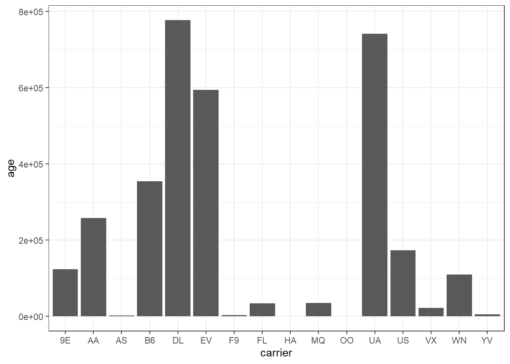

::: {.cell}

```{.r .cell-code}
library(tidyverse)
```

::: {.cell-output .cell-output-stderr}

```
── Attaching core tidyverse packages ──────────────────────── tidyverse 2.0.0 ──
✔ dplyr     1.1.4     ✔ readr     2.1.5
✔ forcats   1.0.0     ✔ stringr   1.5.1
✔ ggplot2   3.5.1     ✔ tibble    3.2.1
✔ lubridate 1.9.3     ✔ tidyr     1.3.1
✔ purrr     1.0.2     
── Conflicts ────────────────────────────────────────── tidyverse_conflicts() ──
✖ dplyr::filter() masks stats::filter()
✖ dplyr::lag()    masks stats::lag()
ℹ Use the conflicted package (<http://conflicted.r-lib.org/>) to force all conflicts to become errors
```


:::

```{.r .cell-code}
library(nycflights13)
```

::: {.cell-output .cell-output-stderr}

```
Warning: package 'nycflights13' was built under R version 4.4.3
```


:::

```{.r .cell-code}
glimpse(flights)
```

::: {.cell-output .cell-output-stdout}

```
Rows: 336,776
Columns: 19
$ year           <int> 2013, 2013, 2013, 2013, 2013, 2013, 2013, 2013, 2013, 2…
$ month          <int> 1, 1, 1, 1, 1, 1, 1, 1, 1, 1, 1, 1, 1, 1, 1, 1, 1, 1, 1…
$ day            <int> 1, 1, 1, 1, 1, 1, 1, 1, 1, 1, 1, 1, 1, 1, 1, 1, 1, 1, 1…
$ dep_time       <int> 517, 533, 542, 544, 554, 554, 555, 557, 557, 558, 558, …
$ sched_dep_time <int> 515, 529, 540, 545, 600, 558, 600, 600, 600, 600, 600, …
$ dep_delay      <dbl> 2, 4, 2, -1, -6, -4, -5, -3, -3, -2, -2, -2, -2, -2, -1…
$ arr_time       <int> 830, 850, 923, 1004, 812, 740, 913, 709, 838, 753, 849,…
$ sched_arr_time <int> 819, 830, 850, 1022, 837, 728, 854, 723, 846, 745, 851,…
$ arr_delay      <dbl> 11, 20, 33, -18, -25, 12, 19, -14, -8, 8, -2, -3, 7, -1…
$ carrier        <chr> "UA", "UA", "AA", "B6", "DL", "UA", "B6", "EV", "B6", "…
$ flight         <int> 1545, 1714, 1141, 725, 461, 1696, 507, 5708, 79, 301, 4…
$ tailnum        <chr> "N14228", "N24211", "N619AA", "N804JB", "N668DN", "N394…
$ origin         <chr> "EWR", "LGA", "JFK", "JFK", "LGA", "EWR", "EWR", "LGA",…
$ dest           <chr> "IAH", "IAH", "MIA", "BQN", "ATL", "ORD", "FLL", "IAD",…
$ air_time       <dbl> 227, 227, 160, 183, 116, 150, 158, 53, 140, 138, 149, 1…
$ distance       <dbl> 1400, 1416, 1089, 1576, 762, 719, 1065, 229, 944, 733, …
$ hour           <dbl> 5, 5, 5, 5, 6, 5, 6, 6, 6, 6, 6, 6, 6, 6, 6, 5, 6, 6, 6…
$ minute         <dbl> 15, 29, 40, 45, 0, 58, 0, 0, 0, 0, 0, 0, 0, 0, 0, 59, 0…
$ time_hour      <dttm> 2013-01-01 05:00:00, 2013-01-01 05:00:00, 2013-01-01 0…
```


:::

```{.r .cell-code}
glimpse(planes)
```

::: {.cell-output .cell-output-stdout}

```
Rows: 3,322
Columns: 9
$ tailnum      <chr> "N10156", "N102UW", "N103US", "N104UW", "N10575", "N105UW…
$ year         <int> 2004, 1998, 1999, 1999, 2002, 1999, 1999, 1999, 1999, 199…
$ type         <chr> "Fixed wing multi engine", "Fixed wing multi engine", "Fi…
$ manufacturer <chr> "EMBRAER", "AIRBUS INDUSTRIE", "AIRBUS INDUSTRIE", "AIRBU…
$ model        <chr> "EMB-145XR", "A320-214", "A320-214", "A320-214", "EMB-145…
$ engines      <int> 2, 2, 2, 2, 2, 2, 2, 2, 2, 2, 2, 2, 2, 2, 2, 2, 2, 2, 2, …
$ seats        <int> 55, 182, 182, 182, 55, 182, 182, 182, 182, 182, 55, 55, 5…
$ speed        <int> NA, NA, NA, NA, NA, NA, NA, NA, NA, NA, NA, NA, NA, NA, N…
$ engine       <chr> "Turbo-fan", "Turbo-fan", "Turbo-fan", "Turbo-fan", "Turb…
```


:::
:::

::: {.cell}

```{.r .cell-code}
plane_age <- planes %>% 
  mutate(age = 2013 - year) %>% 
  inner_join(flights, by = join_by(tailnum)) %>%
  left_join(airports, by = join_by(origin == faa)) %>%
  left_join(airports, by = join_by(dest == faa), suffix = c(".origin", ".dest")) %>% 
  filter(!is.na(age)) %>% 
  mutate(age_group = case_when(
    age %in% c(0:10) ~ "0-10",
    age %in% c(11:20) ~ "11-20",
    age %in% c(21:30) ~ "21-30",
    age %in% c(30:100) ~ ">30"
  ))
```
:::


## Departure Delay by Age

::: {.cell}

```{.r .cell-code}
ggplot(plane_age, aes(x = age, y = dep_delay)) +
  geom_col() +
  coord_cartesian(xlim = c(0, 30)) +
  theme_bw()
```

::: {.cell-output .cell-output-stderr}

```
Warning: Removed 4068 rows containing missing values or values outside the scale range
(`geom_col()`).
```


:::

::: {.cell-output-display}
{width=672}
:::
:::


## Departure Delay by Age Groups

::: {.cell}

```{.r .cell-code}
ggplot(plane_age, aes(x = age_group, y = dep_delay)) +
  geom_col() +
  theme_bw()
```

::: {.cell-output .cell-output-stderr}

```
Warning: Removed 4068 rows containing missing values or values outside the scale range
(`geom_col()`).
```


:::

::: {.cell-output-display}
{width=672}
:::
:::


## Distribution of Age by Carrier

::: {.cell}

```{.r .cell-code}
plane_carrier <- plane_age %>% 
  left_join(airlines, by = join_by(carrier))

ggplot(plane_carrier, aes(x = carrier, y = age)) +
  geom_col() +
  theme_bw()
```

::: {.cell-output-display}
{width=672}
:::
:::
