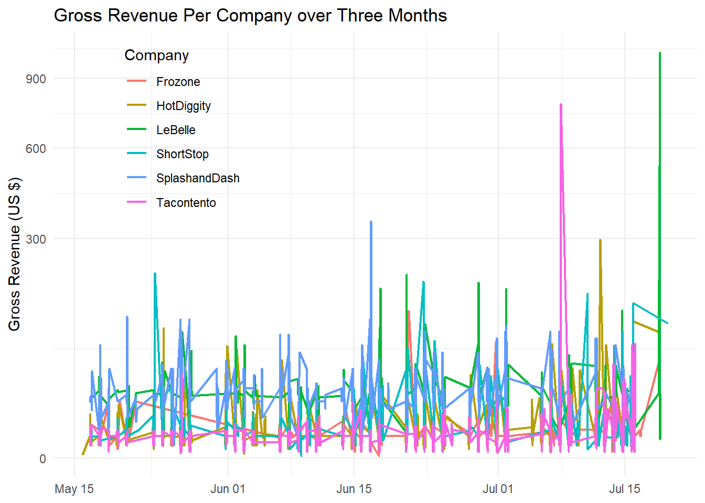
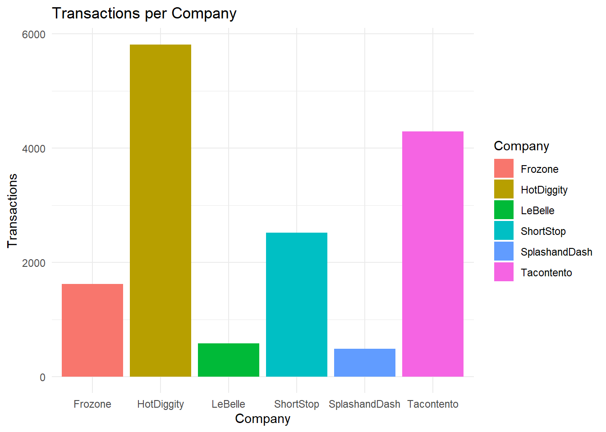
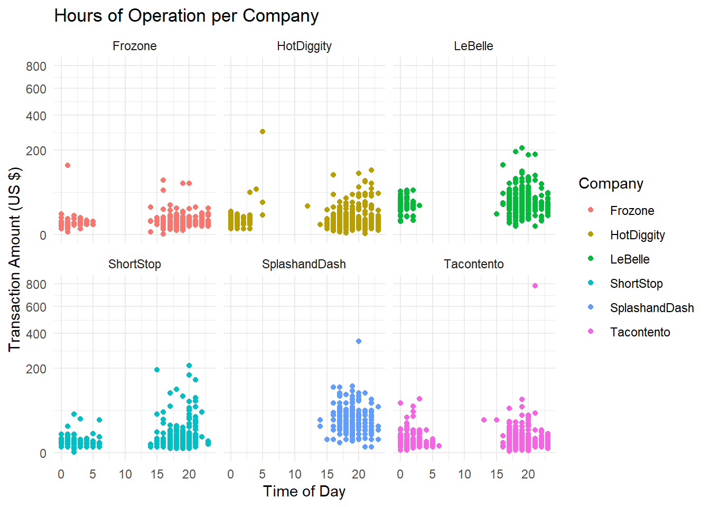

::: {.cell}

```{.r .cell-code}
library(tidyverse)
```

::: {.cell-output .cell-output-stderr}

```
── Attaching core tidyverse packages ──────────────────────── tidyverse 2.0.0 ──
✔ dplyr     1.1.4     ✔ readr     2.1.5
✔ forcats   1.0.0     ✔ stringr   1.5.1
✔ ggplot2   3.5.1     ✔ tibble    3.2.1
✔ lubridate 1.9.3     ✔ tidyr     1.3.1
✔ purrr     1.0.2     
── Conflicts ────────────────────────────────────────── tidyverse_conflicts() ──
✖ dplyr::filter() masks stats::filter()
✖ dplyr::lag()    masks stats::lag()
ℹ Use the conflicted package (<http://conflicted.r-lib.org/>) to force all conflicts to become errors
```


:::

```{.r .cell-code}
library(lubridate)

sales <- read.csv("https://byuistats.github.io/M335/data/sales.csv")

sales2 <- sales %>% 
  filter(Name != "Missing") %>% 
  filter(Time != "2016-04-20T19:01:00Z") %>% 
  filter(Time != "2016-05-13T20:27:00Z") %>% 
  mutate(sale_time = force_tz(ymd_hms(Time), tzone = "America/Denver")) %>% 
  filter(Amount >0) %>% 
  rename("Company" = "Name") %>% 
  separate(sale_time, into = c("date", "timestamp"), sep = -8, remove = FALSE)
  
hourly_sales <- sales2 %>% 
  mutate(hourly = hour(sale_time))

transactions <- sales2 %>% 
  group_by(Company) %>% 
  summarise(Sales = n())


#group_by name and date
```
:::


## Gross Revenue Over Time per Company


::: {.cell}

```{.r .cell-code}
ggplot(data = sales2, aes(x = sale_time, y = Amount, group = Company, color = Company)) +
  geom_line(size = .75) +
  scale_y_continuous(trans = "sqrt") +
  labs(title = "Gross Revenue Per Company over Three Months",
       x = NULL, 
       y = "Gross Revenue (US $)") +
  theme_minimal() +
  theme(legend.position = c(0.2, .78))
```

::: {.cell-output .cell-output-stderr}

```
Warning: Using `size` aesthetic for lines was deprecated in ggplot2 3.4.0.
ℹ Please use `linewidth` instead.
```


:::

::: {.cell-output .cell-output-stderr}

```
Warning: A numeric `legend.position` argument in `theme()` was deprecated in ggplot2
3.5.0.
ℹ Please use the `legend.position.inside` argument of `theme()` instead.
```


:::

::: {.cell-output-display}
{width=672}
:::
:::


## Transactions per Company

# Transactions per Company


::: {.cell}

```{.r .cell-code}
ggplot(data = transactions, aes(x = Company, y = Sales, fill = Company)) + 
  geom_col() +
  labs(title = "Transactions per Company", 
       y = "Transactions") +
  theme_minimal()
```

::: {.cell-output-display}
{width=672}
:::
:::


## Hours of Operation

Hours of Operation


::: {.cell}

```{.r .cell-code}
ggplot(hourly_sales, aes(x = hourly, y = Amount, color = Company, groups = Company)) +
  geom_point() +
  labs(title = "Hours of Operation per Company", 
       x = "Time of Day",
       y = "Transaction Amount (US $)") +
  scale_y_continuous(trans = "sqrt",
                     limits = c(0, 800)) +
  facet_wrap(~Company, nrow = 2, ncol = 3) +
  theme_minimal()
```

::: {.cell-output .cell-output-stderr}

```
Warning: Removed 1 row containing missing values or values outside the scale range
(`geom_point()`).
```


:::

::: {.cell-output-display}
{width=672}
:::

```{.r .cell-code}
#scale_x_continuous(breaks = seq(0, 24, 2)) +
```
:::


I would give a loan to LeBelle. They seemed to perform the best because they have fewer transactions, but more income than the other companies at a higher rate. This tells me that their products are more expensive, but they seem to have a consistent rate of sales over the three months. At the very end of the three month period, they also experienced a sharp increase of sales, reaching over $900 in revenue in just one day. In addition, they seem to have a steady amount of transactions throughout all hours of operation.