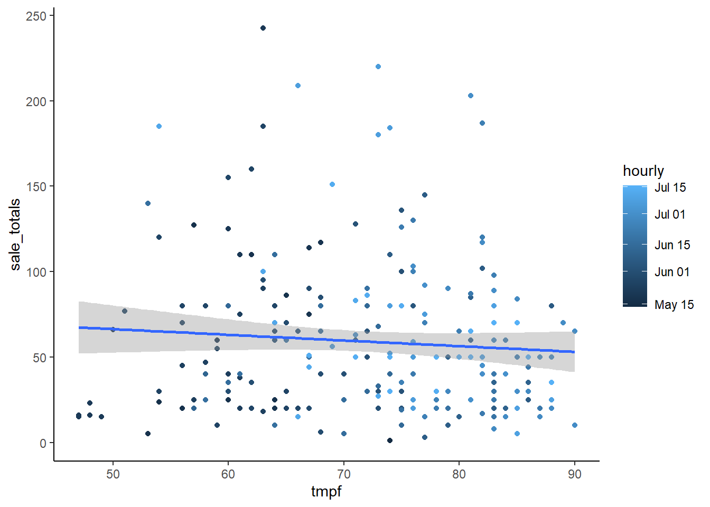

::: {.cell}

```{.r .cell-code}
library(tidyverse)
```

::: {.cell-output .cell-output-stderr}

```
── Attaching core tidyverse packages ──────────────────────── tidyverse 2.0.0 ──
✔ dplyr     1.1.4     ✔ readr     2.1.5
✔ forcats   1.0.0     ✔ stringr   1.5.1
✔ ggplot2   3.5.1     ✔ tibble    3.2.1
✔ lubridate 1.9.3     ✔ tidyr     1.3.1
✔ purrr     1.0.2     
── Conflicts ────────────────────────────────────────── tidyverse_conflicts() ──
✖ dplyr::filter() masks stats::filter()
✖ dplyr::lag()    masks stats::lag()
ℹ Use the conflicted package (<http://conflicted.r-lib.org/>) to force all conflicts to become errors
```


:::

```{.r .cell-code}
library(lubridate)
library(riem)
```

::: {.cell-output .cell-output-stderr}

```
Warning: package 'riem' was built under R version 4.4.3
```


:::

```{.r .cell-code}
carwash_data <- read.csv("https://byuistats.github.io/M335/data/carwash.csv")
```
:::

::: {.cell}

```{.r .cell-code}
carwash <- carwash_data %>% 
  mutate(sale_time = with_tz(ymd_hms(time), tzone = "America/Denver")) %>% 
  filter(amount > 0) %>%
  mutate(hourly = ceiling_date(sale_time, unit = "hours")) %>%
  group_by(hourly) %>% summarise(sale_totals = sum(amount))

temp <- riem_measures(station = "RXE", date_start = "2016-05-13", date_end = "2016-07-18") %>% 
  mutate(hourly = ceiling_date(valid, unit = "hours")) %>% 
  select(c(hourly, tmpf))

carwash_temp <- carwash %>% 
  left_join(temp, by = join_by(hourly)) %>% 
  filter(!is.na(tmpf)) %>% 
  filter(sale_totals < 300)
```
:::

::: {.cell}

```{.r .cell-code}
ggplot(carwash_temp, aes(x = tmpf, y = sale_totals, color = hourly)) +
  geom_point() +
  geom_smooth(method = "lm") +
  theme_classic()
```

::: {.cell-output .cell-output-stderr}

```
`geom_smooth()` using formula = 'y ~ x'
```


:::

::: {.cell-output .cell-output-stderr}

```
Warning: The following aesthetics were dropped during statistical transformation:
colour.
ℹ This can happen when ggplot fails to infer the correct grouping structure in
  the data.
ℹ Did you forget to specify a `group` aesthetic or to convert a numerical
  variable into a factor?
```


:::

::: {.cell-output-display}
{width=672}
:::
:::


According to the chart, it seems that as temperature increases, sale amounts tend to decrease. However, there are fewer sales with lower temperature, and increased sales with warmer temperatures. Perhaps with fewer sales, the outliers are more likely to drag the average amount per sale up, while increased number of sales decreases the average because the majority of customers are making smaller sales. So while the average amount per sale decreases, the overall number of sales increases with temperature.

### AI Disclosure

I chose to use ChatGPT and Gemini AI to assist me with this assignment by tutoring me on what aggregating means and determining the sources of the errors in my code. I chose to use this tool because it was an accessible tutor that could teach me specifically for the context of coding, and it could help detect specific errors in my code and explain exactly why my previous methods didn't work. It affected my learning by teaching me what it means to aggregate and how I can do that more easily in the future, and by lessening the time that it took to debug my code. It's possible that I could be spending more time trying to figure out errors by myself before turning to AI.
