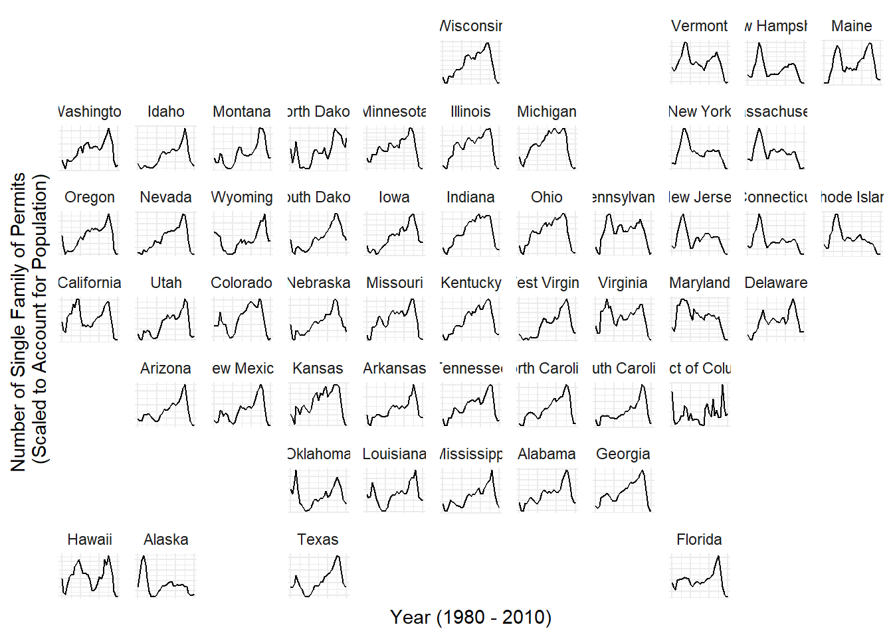
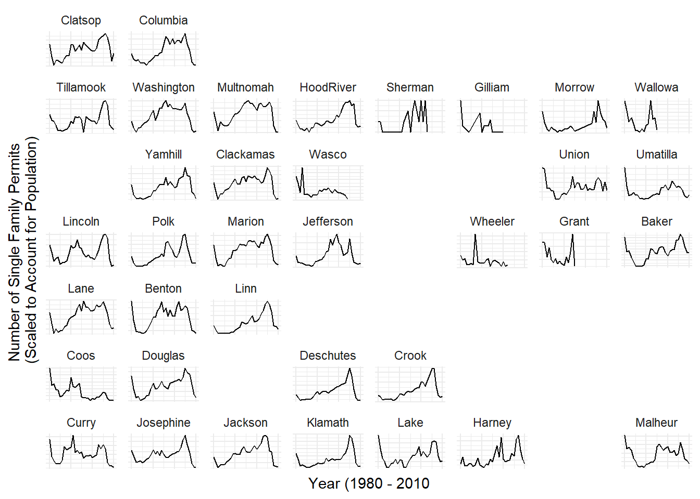

::: {.cell}

```{.r .cell-code}
library(tidyverse)
```

::: {.cell-output .cell-output-stderr}

```
── Attaching core tidyverse packages ──────────────────────── tidyverse 2.0.0 ──
✔ dplyr     1.1.4     ✔ readr     2.1.5
✔ forcats   1.0.0     ✔ stringr   1.5.1
✔ ggplot2   3.5.1     ✔ tibble    3.2.1
✔ lubridate 1.9.3     ✔ tidyr     1.3.1
✔ purrr     1.0.2     
── Conflicts ────────────────────────────────────────── tidyverse_conflicts() ──
✖ dplyr::filter() masks stats::filter()
✖ dplyr::lag()    masks stats::lag()
ℹ Use the conflicted package (<http://conflicted.r-lib.org/>) to force all conflicts to become errors
```


:::

```{.r .cell-code}
library(USAboundaries)
library(sf)
```

::: {.cell-output .cell-output-stderr}

```
Warning: package 'sf' was built under R version 4.4.3
```


:::

::: {.cell-output .cell-output-stderr}

```
Linking to GEOS 3.13.0, GDAL 3.10.1, PROJ 9.5.1; sf_use_s2() is TRUE
```


:::

```{.r .cell-code}
library(buildings)
library(geofacet)
```

::: {.cell-output .cell-output-stderr}

```
Warning: package 'geofacet' was built under R version 4.4.3
```


:::

```{.r .cell-code}
states <- us_states() %>% 
  mutate(statefp = as.numeric(statefp))

single_family <- permits %>% 
  filter(variable == "Single Family") %>% 
  rename(statefp = state) %>% 
  left_join(states, join_by(statefp)) %>% 
  group_by(state_name, year) %>% 
  summarise(state_permits = sum(value))
```

::: {.cell-output .cell-output-stderr}

```
`summarise()` has grouped output by 'state_name'. You can override using the
`.groups` argument.
```


:::

```{.r .cell-code}
ORcounties <- us_counties(states = "Oregon") %>% 
  { .[, -13] } %>% 
  mutate(statefp = as.numeric(statefp)) %>% 
  mutate(county = as.numeric(countyfp))

ORpermits <- permits %>% 
  filter(StateAbbr == "OR") %>% 
  filter(variable == "Single Family") %>% 
  left_join(ORcounties, join_by(county)) %>% 
  mutate(name = recode(name,
                       "Hood River" = "HoodRiver"))

View(permits)
```
:::


## Single Family Permits across the US


::: {.cell}

```{.r .cell-code}
ggplot(single_family, aes(x = year, y = state_permits, group = state_name)) +
  geom_line() +
  facet_geo(facets = ~state_name, grid = us_state_grid1, label = NULL, scales = "free_y") +
  labs(x = "Year (1980 - 2010)",
       y = "Number of Single Family of Permits \n(Scaled to Account for Population)") + 
  scale_x_continuous(labels = NULL) +
  scale_y_continuous(labels = NULL) +
  theme_minimal()
```

::: {.cell-output-display}
{width=672}
:::

```{.r .cell-code}
# maybe group by county in aes to create the right geom_line
```
:::


## Single Family Permits across Oregon Counties


::: {.cell}

```{.r .cell-code}
ggplot(ORpermits, aes(x = year, y = value)) +
  geom_line() +
  facet_geo(facets = ~name,
            grid = us_or_counties_grid1,
            label = NULL,
            scale = "free_y") +
  scale_x_continuous(labels = NULL) +
  scale_y_continuous(labels = NULL) +
    labs(x = "Year (1980 - 2010",
         y = "Number of Single Family Permits \n(Scaled to Account for Population)") +
    theme_minimal()
```

::: {.cell-output-display}
{width=672}
:::
:::


## Conclusion

Regardless of scale, each state experiences a drop in single family permits in the most recent years, mimicking the mortgage crisis around 2007-2010. Some states are smaller than others and have less noticeable changes over time, so the scale was adjusted to demonstrate that each state, whether heavily populated or not, experienced a significant decrease in permits. Each state was affected by the market crash.

In Oregon, single family permits on a county level followed the same pattern. Each county that was still organized in the most recent decade experienced a decline in permits between 2007 - 2010 compared to the level they were at previously. Once again, the scale was adjusted to compensate for smaller county population levels and make comparison possible against larger counties.

I chose to eliminate axis labels to reduce clutter and encourage a focus on the pattern followed by each state and each county in recent years. Regardless of the level of single family permits for each state and county previous to 2007, it is easier to see that the rate declined even further during the recent years.

## AI Disclosure

I chose to use ChatGPT AI to assist me with this assignment by asking it how to effectively use certain functions and what certain errors were trying to tell me. I chose to use this tool because it was quick and could give answers specific to my coding needs, and it affected my learning by helping me to learn how to use geofacet and decide if I was going to make further changes to my graph (which I eventually decided to abandon because it was too difficult).
