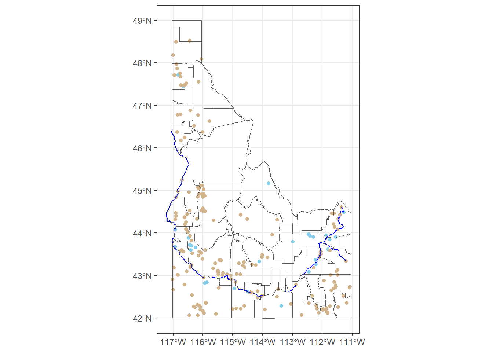

::: {.cell}

```{.r .cell-code}
library(sf)
```

::: {.cell-output .cell-output-stderr}

```
Warning: package 'sf' was built under R version 4.4.3
```


:::

::: {.cell-output .cell-output-stderr}

```
Linking to GEOS 3.13.0, GDAL 3.10.1, PROJ 9.5.1; sf_use_s2() is TRUE
```


:::

```{.r .cell-code}
library(tidyverse)
```

::: {.cell-output .cell-output-stderr}

```
── Attaching core tidyverse packages ──────────────────────── tidyverse 2.0.0 ──
✔ dplyr     1.1.4     ✔ readr     2.1.5
✔ forcats   1.0.0     ✔ stringr   1.5.1
✔ ggplot2   3.5.1     ✔ tibble    3.2.1
✔ lubridate 1.9.3     ✔ tidyr     1.3.1
✔ purrr     1.0.2     
```


:::

::: {.cell-output .cell-output-stderr}

```
── Conflicts ────────────────────────────────────────── tidyverse_conflicts() ──
✖ dplyr::filter() masks stats::filter()
✖ dplyr::lag()    masks stats::lag()
ℹ Use the conflicted package (<http://conflicted.r-lib.org/>) to force all conflicts to become errors
```


:::
:::

::: {.cell}

```{.r .cell-code}
wells_path <- tempfile(); uf1 <- tempfile()
download.file("https://byuistats.github.io/M335/data/Wells.zip", wells_path)

dams_path <- tempfile(); uf2 <- tempfile()
download.file("https://byuistats.github.io/M335/data/Idaho_Dams.zip", dams_path)

water_path <- tempfile(); uf3 <- tempfile()
download.file("https://byuistats.github.io/M335/data/water.zip", water_path)

state_shape_path <- tempfile(); uf4 <- tempfile()
download.file("https://byuistats.github.io/M335/data/shp.zip", state_shape_path)

unzip(wells_path, exdir = uf1)
wells <- read_sf(uf1)

unzip(dams_path, exdir = uf2)
dams <- read_sf(uf2)

unzip(water_path, exdir = uf3)
water <- read_sf(uf3)

unzip(state_shape_path, exdir = uf4)
state_shape <- read_sf(uf4)
```
:::

::: {.cell}

```{.r .cell-code}
wells2 <- wells %>% 
  filter(Production > 5000)

dams2 <- dams %>% 
  filter(SurfaceAre > 50)

water2 <- water %>% 
  filter(FEAT_NAME %in% c("Snake River", "Henrys Fork")) %>% 
  filter(STATE == "IDAH")

state_shape2 <- state_shape %>% 
  filter(StateName == "Idaho")

ID_counties <- USAboundaries::us_counties(states = "ID")
st_crs(ID_counties)
```

::: {.cell-output .cell-output-stdout}

```
Coordinate Reference System:
  User input: EPSG:4326 
  wkt:
GEOGCRS["WGS 84",
    DATUM["World Geodetic System 1984",
        ELLIPSOID["WGS 84",6378137,298.257223563,
            LENGTHUNIT["metre",1]]],
    PRIMEM["Greenwich",0,
        ANGLEUNIT["degree",0.0174532925199433]],
    CS[ellipsoidal,2],
        AXIS["geodetic latitude (Lat)",north,
            ORDER[1],
            ANGLEUNIT["degree",0.0174532925199433]],
        AXIS["geodetic longitude (Lon)",east,
            ORDER[2],
            ANGLEUNIT["degree",0.0174532925199433]],
    USAGE[
        SCOPE["Horizontal component of 3D system."],
        AREA["World."],
        BBOX[-90,-180,90,180]],
    ID["EPSG",4326]]
```


:::

```{.r .cell-code}
11:58
```

::: {.cell-output .cell-output-stdout}

```
 [1] 11 12 13 14 15 16 17 18 19 20 21 22 23 24 25 26 27 28 29 30 31 32 33 34 35
[26] 36 37 38 39 40 41 42 43 44 45 46 47 48 49 50 51 52 53 54 55 56 57 58
```


:::
:::

::: {.cell}

```{.r .cell-code}
target_crs <- st_crs(4326)

ID_counties  <- st_transform(ID_counties, target_crs)
wells2       <- st_transform(wells2, target_crs)
dams2        <- st_transform(dams2, target_crs)
water2       <- st_transform(water2, target_crs)
state_shape2  <- st_transform(state_shape2, target_crs)
```
:::

::: {.cell}

```{.r .cell-code}
default_CRS_map <- ggplot() +
  geom_sf(data = ID_counties, fill = NA) +
  geom_sf(data = wells2, color = "skyblue") +
  geom_sf(data = dams2, color = "tan") +
  geom_sf(data = water2, color = "blue") +
  geom_sf(data = state_shape2, fill = NA) +
  theme_bw()

default_CRS_map +
  coord_sf(crs = st_crs(4326))
```

::: {.cell-output-display}
{width=672}
:::

```{.r .cell-code}
ggsave(filename = "Idaho Water.png", width = 15, height = 10)

#4326
```
:::


## AI Disclosure

I chose to use ChatGPT AI to assist me with this assignment by troubleshooting the errors for why my code wasn't running. I chose to use this tool because it was customizable to my problem, and it affected my learning by helping me to create an effective graph. I specifically asked to be given next steps rather than a completed version of my code.

