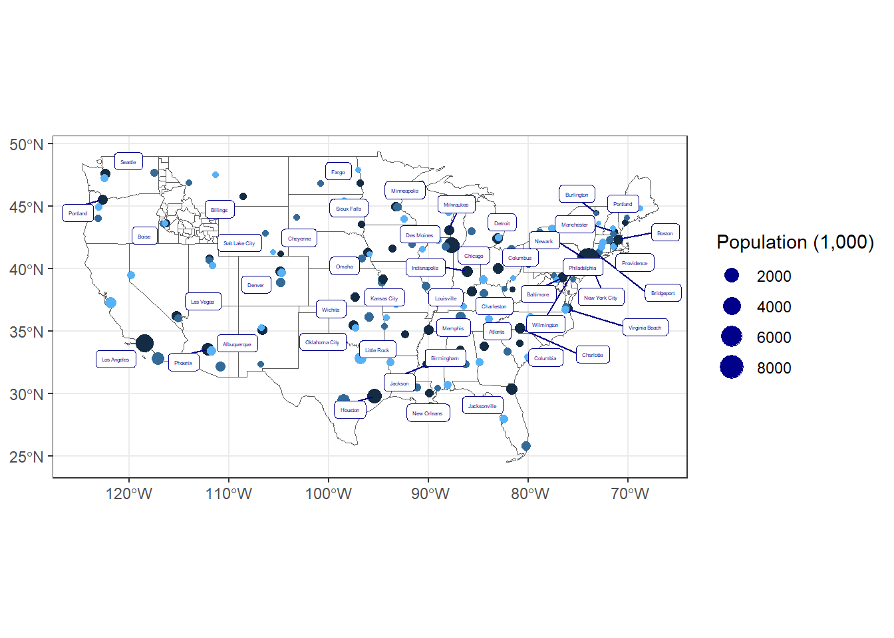

::: {.cell}

```{.r .cell-code}
library(tidyverse)
```

::: {.cell-output .cell-output-stderr}

```
── Attaching core tidyverse packages ──────────────────────── tidyverse 2.0.0 ──
✔ dplyr     1.1.4     ✔ readr     2.1.5
✔ forcats   1.0.0     ✔ stringr   1.5.1
✔ ggplot2   3.5.1     ✔ tibble    3.2.1
✔ lubridate 1.9.3     ✔ tidyr     1.3.1
✔ purrr     1.0.2     
── Conflicts ────────────────────────────────────────── tidyverse_conflicts() ──
✖ dplyr::filter() masks stats::filter()
✖ dplyr::lag()    masks stats::lag()
ℹ Use the conflicted package (<http://conflicted.r-lib.org/>) to force all conflicts to become errors
```


:::

```{.r .cell-code}
library(sf)
```

::: {.cell-output .cell-output-stderr}

```
Warning: package 'sf' was built under R version 4.4.3
```


:::

::: {.cell-output .cell-output-stderr}

```
Linking to GEOS 3.13.0, GDAL 3.10.1, PROJ 9.5.1; sf_use_s2() is TRUE
```


:::

```{.r .cell-code}
library(USAboundaries)
library(ggrepel)
```

::: {.cell-output .cell-output-stderr}

```
Warning: package 'ggrepel' was built under R version 4.4.3
```


:::
:::

::: {.cell}

```{.r .cell-code}
idaho <- us_counties(states = "Idaho")


US <- us_states() %>% 
  filter(!state_name %in% c("Puerto Rico", "Alaska", "Hawaii", "District of Columbia"))

US_cities <- us_cities() %>%
  filter(!state_name %in% c("Puerto Rico", "Alaska", "Hawaii", "District of Columbia")) %>% 
  select(c(city, state_name, population)) %>% 
  group_by(state_name) %>% 
  slice_max(population, n = 3) %>% 
  arrange(desc(population), .by_group = TRUE) %>% 
  mutate(rank = c(1, 2, 3))
```

::: {.cell-output .cell-output-stderr}

```
City populations for contemporary data come from the 2010 census.
```


:::

```{.r .cell-code}
city_labels <- US_cities %>% 
  slice_max(population, n = 1)

# assignment: color = rank, names of cities = ggrepel and biggest city labelled
```
:::

::: {.cell}

```{.r .cell-code}
ggplot() + 
  geom_sf(data = US, fill = NA, color= "gray35") +
  geom_sf(data = idaho, fill = NA, color = "gray35") +
  geom_sf(data = US_cities, aes(color = rank, size = population/1000)) +
  geom_label_repel(data = city_labels, aes(label = city, geometry = geometry),
                   stat = "sf_coordinates", 
                   size = 1, 
                   color = "darkblue",
                   force = 1,
                   force_pull = 0.3,
                   max.overlaps = Inf) +
  labs(x = NULL,
       y = NULL,
       color = NULL,
       size = "Population (1,000)") +
  guides(color = "none",
         size = guide_legend(override.aes = list(color = "darkblue"))) +
  theme_bw()
```

::: {.cell-output .cell-output-stderr}

```
Warning in st_point_on_surface.sfc(sf::st_zm(x)): st_point_on_surface may not
give correct results for longitude/latitude data
```


:::

::: {.cell-output-display}
{width=672}
:::

```{.r .cell-code}
ggsave(filename = "US-Cities-Map.png", width = 15, height = 10)
```

::: {.cell-output .cell-output-stderr}

```
Warning in st_point_on_surface.sfc(sf::st_zm(x)): st_point_on_surface may not
give correct results for longitude/latitude data
```


:::
:::


I chose to use ChatGPT AI to assist me with this assignment by tutoring me on how to create a basic map chart and finding ways to use code when the textbook didnt have examples to guide me. I chose to use this tool because it could give me examples or help when I couldn't find something in the book, and it affected my learning by teaching me how to use new functions I hadn't tried before for a new type of assignment.

