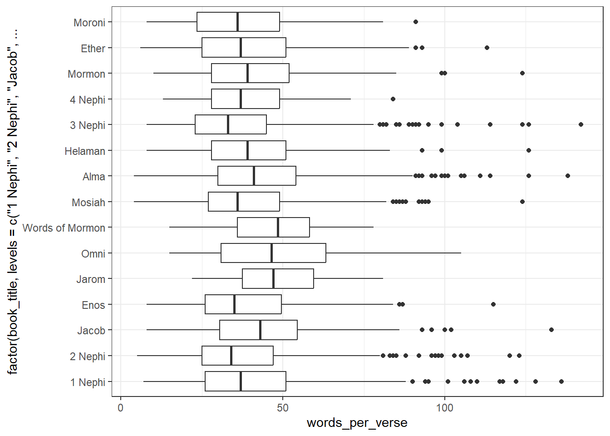

::: {.cell}

```{.r .cell-code}
library(tidyverse)
```

::: {.cell-output .cell-output-stderr}

```
── Attaching core tidyverse packages ──────────────────────── tidyverse 2.0.0 ──
✔ dplyr     1.1.4     ✔ readr     2.1.5
✔ forcats   1.0.0     ✔ stringr   1.5.1
✔ ggplot2   3.5.1     ✔ tibble    3.2.1
✔ lubridate 1.9.3     ✔ tidyr     1.3.1
✔ purrr     1.0.2     
── Conflicts ────────────────────────────────────────── tidyverse_conflicts() ──
✖ dplyr::filter() masks stats::filter()
✖ dplyr::lag()    masks stats::lag()
ℹ Use the conflicted package (<http://conflicted.r-lib.org/>) to force all conflicts to become errors
```


:::

```{.r .cell-code}
library(stringi)
```
:::

::: {.cell}

```{.r .cell-code}
scriptures <- read_csv("https://github.com/beandog/lds-scriptures/raw/master/csv/lds-scriptures.csv")
```

::: {.cell-output .cell-output-stderr}

```
Rows: 41995 Columns: 19
── Column specification ────────────────────────────────────────────────────────
Delimiter: ","
chr (13): volume_title, book_title, volume_long_title, book_long_title, volu...
dbl  (6): volume_id, book_id, chapter_id, verse_id, chapter_number, verse_nu...

ℹ Use `spec()` to retrieve the full column specification for this data.
ℹ Specify the column types or set `show_col_types = FALSE` to quiet this message.
```


:::
:::


## Average Verse Length

::: {.cell}

```{.r .cell-code}
verses <- scriptures %>% 
  filter(volume_short_title %in% c("NT", "BoM")) %>% 
  group_by(volume_short_title) %>% 
  summarise(average_words = mean(str_count(scripture_text, boundary("word"))))

verses
```

::: {.cell-output .cell-output-stdout}

```
# A tibble: 2 × 2
  volume_short_title average_words
  <chr>                      <dbl>
1 BoM                         40.5
2 NT                          22.7
```


:::
:::


## Count of the Savior's Name

::: {.cell}

```{.r .cell-code}
scriptures2 <- scriptures %>% 
  filter(volume_short_title %in% c("NT", "BoM")) %>% 
  group_by(volume_short_title) %>% 
  summarise(name_count = sum(str_count(scripture_text, "Jesus")))

scriptures2
```

::: {.cell-output .cell-output-stdout}

```
# A tibble: 2 × 2
  volume_short_title name_count
  <chr>                   <int>
1 BoM                       184
2 NT                        983
```


:::
:::


## Word Count by Verse for BoM Books

::: {.cell}

```{.r .cell-code}
versecount <- scriptures %>% 
  filter(volume_short_title == "BoM") %>% 
  group_by(book_title, scripture_text) %>% 
  summarise(words_per_verse = sum(str_count(scripture_text, boundary("word"))))
```

::: {.cell-output .cell-output-stderr}

```
`summarise()` has grouped output by 'book_title'. You can override using the
`.groups` argument.
```


:::

```{.r .cell-code}
ggplot(versecount, aes(x = factor(book_title, levels = c("1 Nephi", "2 Nephi", "Jacob", "Enos", "Jarom", "Omni", "Words of Mormon", "Mosiah", "Alma", "Helaman", "3 Nephi", "4 Nephi", "Mormon", "Ether", "Moroni")), y = words_per_verse)) +
  geom_boxplot() +
  coord_flip() +
  theme_bw()
```

::: {.cell-output-display}
{width=672}
:::
:::
