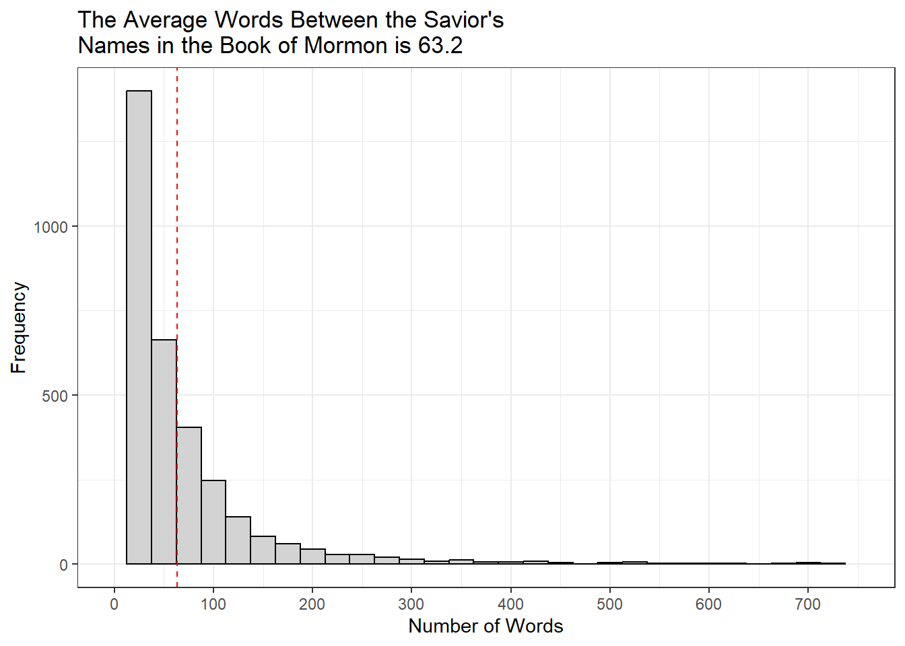

::: {.cell}

```{.r .cell-code}
library(tidyverse)
```

::: {.cell-output .cell-output-stderr}

```
── Attaching core tidyverse packages ──────────────────────── tidyverse 2.0.0 ──
✔ dplyr     1.1.4     ✔ readr     2.1.5
✔ forcats   1.0.0     ✔ stringr   1.5.1
✔ ggplot2   3.5.1     ✔ tibble    3.2.1
✔ lubridate 1.9.3     ✔ tidyr     1.3.1
✔ purrr     1.0.2     
── Conflicts ────────────────────────────────────────── tidyverse_conflicts() ──
✖ dplyr::filter() masks stats::filter()
✖ dplyr::lag()    masks stats::lag()
ℹ Use the conflicted package (<http://conflicted.r-lib.org/>) to force all conflicts to become errors
```


:::

```{.r .cell-code}
library(stringi)

scriptures <- read_csv("https://github.com/beandog/lds-scriptures/raw/master/csv/lds-scriptures.csv")
```

::: {.cell-output .cell-output-stderr}

```
Rows: 41995 Columns: 19
── Column specification ────────────────────────────────────────────────────────
Delimiter: ","
chr (13): volume_title, book_title, volume_long_title, book_long_title, volu...
dbl  (6): volume_id, book_id, chapter_id, verse_id, chapter_number, verse_nu...

ℹ Use `spec()` to retrieve the full column specification for this data.
ℹ Specify the column types or set `show_col_types = FALSE` to quiet this message.
```


:::

```{.r .cell-code}
savior_names <- read_rds("https://byuistats.github.io/M335/data/BoM_SaviorNames.rds")
```
:::

::: {.cell}

```{.r .cell-code}
scriptures2 <- scriptures %>% 
  filter(volume_short_title == "BoM")
  
the_names <- str_c(savior_names$name, collapse = "|")

the_text <- str_split(scriptures2$scripture_text, pattern = the_names)

the_text2 <- tibble(value = unlist(the_text))

names_data <- the_text2%>% 
  group_by(value) %>% 
  summarise(number_words = sum(str_count(value, boundary("word")))) %>% 
  filter(number_words != "0")

names_mean <- names_data %>%
  summarise(mean = mean(number_words))
```
:::

::: {.cell}

```{.r .cell-code}
ggplot(data = names_data, aes(x = value, y = number_words)) +
  geom_point() +
  geom_hline(yintercept = names_mean$mean, color = "red") +
  scale_x_discrete(labels = NULL) +
  theme_classic()
```

::: {.cell-output-display}
{width=672}
:::
:::


## AI Disclosure

I chose to use ChatGPT AI to assist me with this assignment by tutoring me on how to use the functions and troubleshooting my code. I chose to use this tool because I was stuck on how to continue and I wasn't feeling very confident with the necessary functions. It affected my learning by correcting some of my functions and syntax, but overall it wasn't very helpful, and it wasn't able to clarify some of the things I was confused about.
