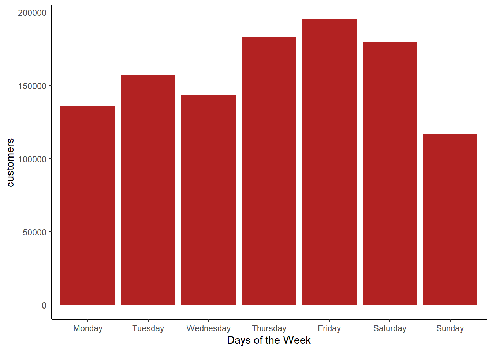
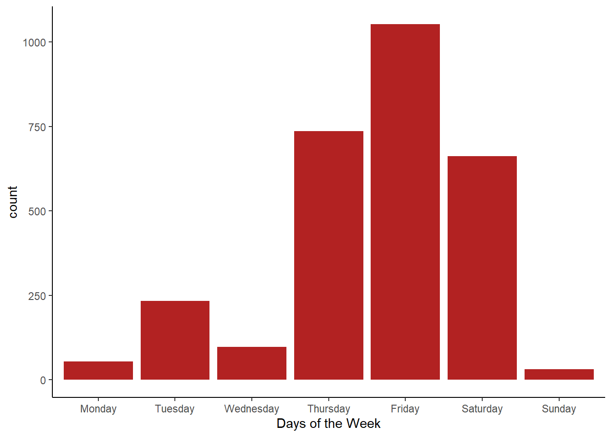

::: {.cell}

```{.r .cell-code}
library(tidyverse)
```

::: {.cell-output .cell-output-stderr}

```
── Attaching core tidyverse packages ──────────────────────── tidyverse 2.0.0 ──
✔ dplyr     1.1.4     ✔ readr     2.1.5
✔ forcats   1.0.0     ✔ stringr   1.5.1
✔ ggplot2   3.5.1     ✔ tibble    3.2.1
✔ lubridate 1.9.3     ✔ tidyr     1.3.1
✔ purrr     1.0.2     
── Conflicts ────────────────────────────────────────── tidyverse_conflicts() ──
✖ dplyr::filter() masks stats::filter()
✖ dplyr::lag()    masks stats::lag()
ℹ Use the conflicted package (<http://conflicted.r-lib.org/>) to force all conflicts to become errors
```


:::

```{.r .cell-code}
library(stringi)
```
:::

::: {.cell}

```{.r .cell-code}
data_chipotle <- read_csv("https://byuistats.github.io/M335/data/chipotle_reduced.csv")
```

::: {.cell-output .cell-output-stderr}

```
Rows: 2844 Columns: 22
── Column specification ────────────────────────────────────────────────────────
Delimiter: ","
chr  (12): placekey, street_address, city, region, open_hours, visits_by_day...
dbl   (8): latitude, longitude, postal_code, phone_number, raw_visit_counts,...
dttm  (2): date_range_start, date_range_end

ℹ Use `spec()` to retrieve the full column specification for this data.
ℹ Specify the column types or set `show_col_types = FALSE` to quiet this message.
```


:::

```{.r .cell-code}
View(data_chipotle)
```
:::

::: {.cell}

```{.r .cell-code}
## Previous Functions

chipotle <- function(x) {
  weekday <- str_extract_all(x, "[:alpha:]+") %>% unlist()
  customers <- str_extract_all(x, "\\d+") %>% unlist() %>% as.numeric()
  tibble(weekday, customers) %>% arrange(desc(customers))
}

chipotle_day <- function(x) {
  chipotle(x) %>% slice_max(customers, n = 1) %>% 
  pull(weekday) %>% str_c()
}
```
:::


## Function 1

::: {.cell}

```{.r .cell-code}
## Function #1

promotion_day2 <- data_chipotle %>% 
  filter(!is.na(popularity_by_day)) %>% 
  mutate(popularity = map(popularity_by_day, chipotle))

promotion_day3 <- promotion_day2 %>% 
  unnest(popularity) %>% 
  group_by(weekday) %>% 
  summarise(customers = sum(customers))

ggplot(promotion_day3, aes(x = factor(weekday, levels = c("Monday", "Tuesday", "Wednesday", "Thursday", "Friday", "Saturday", "Sunday")), y = customers)) + 
  geom_col(fill = "firebrick") +
  labs(x = "Days of the Week") +
  theme_classic()
```

::: {.cell-output-display}
{width=672}
:::

```{.r .cell-code}
# total visits for the entire company, benefits the franchisees if they pay a monthly subscription and benefit from the label doing well
```
:::


## Function 2

::: {.cell}

```{.r .cell-code}
## Function #2

data_chipotle <- data_chipotle %>% filter(!is.na(popularity_by_day))

promotion_day <- data_chipotle %>%
  filter(!is.na(popularity_by_day)) %>%
  mutate(popularity = map(popularity_by_day, chipotle_day)) %>% unnest(popularity)
  

ggplot(promotion_day, aes(x = factor(popularity, levels = c("Monday", "Tuesday", "Wednesday", "Thursday", "Friday", "Saturday", "Sunday")))) +
  geom_bar(fill = "firebrick") +
  labs(x = "Days of the Week") +
  theme_classic()
```

::: {.cell-output-display}
{width=672}
:::

```{.r .cell-code}
# one observation per store, unweighted, representative of all stores, benefits the franchisees if 
```
:::

::: {.cell}

```{.r .cell-code}
saveRDS(promotion_day2, "chipotle_purrr.rds")
```
:::


## Business Recommendation

Based on both charts, I would recommend that Chipotle run their promotions on Thursday and Friday. Regardless of which measurement is used, Thursday and Friday are the highest performing days overall and see the most visits. I was lead to this decision because the popular days are visible in the first function, but the second function makes this pattern even more apparent because it is measuring only the highest performing day of the week for each store. In other words, the majority of stores experience high sales rates on Thursday, Friday, and Saturday.

While the second function only records the highest performing day of the week for the different stores, the first function takes into account all visits from the stores throughout the week, including less popular or slow days. These measurements highlight that a promotion would influence the businesses differently depending on the business model, and it's important to consider the goal of the promotion.
