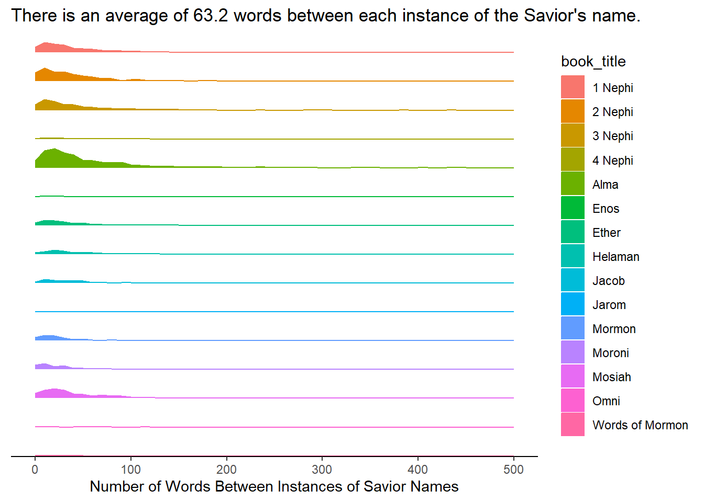

::: {.cell}

```{.r .cell-code}
library(tidyverse)
```

::: {.cell-output .cell-output-stderr}

```
── Attaching core tidyverse packages ──────────────────────── tidyverse 2.0.0 ──
✔ dplyr     1.1.4     ✔ readr     2.1.5
✔ forcats   1.0.0     ✔ stringr   1.5.1
✔ ggplot2   3.5.1     ✔ tibble    3.2.1
✔ lubridate 1.9.3     ✔ tidyr     1.3.1
✔ purrr     1.0.2     
── Conflicts ────────────────────────────────────────── tidyverse_conflicts() ──
✖ dplyr::filter() masks stats::filter()
✖ dplyr::lag()    masks stats::lag()
ℹ Use the conflicted package (<http://conflicted.r-lib.org/>) to force all conflicts to become errors
```


:::

```{.r .cell-code}
library(stringi)

scriptures <- read_csv("https://github.com/beandog/lds-scriptures/raw/master/csv/lds-scriptures.csv")
```

::: {.cell-output .cell-output-stderr}

```
Rows: 41995 Columns: 19
── Column specification ────────────────────────────────────────────────────────
Delimiter: ","
chr (13): volume_title, book_title, volume_long_title, book_long_title, volu...
dbl  (6): volume_id, book_id, chapter_id, verse_id, chapter_number, verse_nu...

ℹ Use `spec()` to retrieve the full column specification for this data.
ℹ Specify the column types or set `show_col_types = FALSE` to quiet this message.
```


:::

```{.r .cell-code}
savior_names <- read_rds("https://byuistats.github.io/M335/data/BoM_SaviorNames.rds")
```
:::

::: {.cell}

```{.r .cell-code}
the_names <- str_c(savior_names$name, collapse = "|")

books <- function(x) {
  scriptures2 <- str_c(x$scripture_text) %>% 
  str_flatten() %>% str_split(pattern = the_names)
  word_count <- unlist(scriptures2) %>% str_count(pattern = "\\S+") 
}

scriptures <- scriptures %>% 
  filter(volume_short_title == "BoM")

scriptures2 <- scriptures %>% 
  group_by(book_title) %>% 
  nest() %>% 
  mutate(distance_between = map(data, books)) %>% 
  select(c(book_title, distance_between)) %>% 
  unnest(distance_between)
```
:::

::: {.cell}

```{.r .cell-code}
ggplot(scriptures2, aes(x = distance_between, fill = book_title, color = book_title)) +
  geom_area(stat = "bin") +
  labs(x = "Number of Words Between Instances of Savior Names",
       y = NULL, 
       title = "There is an average of 63.2 words between each instance of the Savior's name.") +
  scale_y_continuous(limits = c(0, 10),
                     labels = NULL, ) +
  scale_x_continuous(trans = "sqrt",
                     limits = c(0, 2000)) +
  theme_classic() +
  theme(axis.ticks.y = element_blank(),
        strip.text = element_blank(),
        legend.title = element_text()) +
  facet_grid(book_title~.)
```

::: {.cell-output .cell-output-stderr}

```
`stat_bin()` using `bins = 30`. Pick better value with `binwidth`.
```


:::

::: {.cell-output .cell-output-stderr}

```
Warning: Removed 2 rows containing non-finite outside the scale range
(`stat_bin()`).
```


:::

::: {.cell-output-display}
{width=672}
:::

```{.r .cell-code}
# mean_count <- mean(word_count)
# # 63.2
# 
# word_tibble <- tibble(word_count) %>% 
#   filter(word_count >= 0)
```
:::

::: {.cell}

:::
