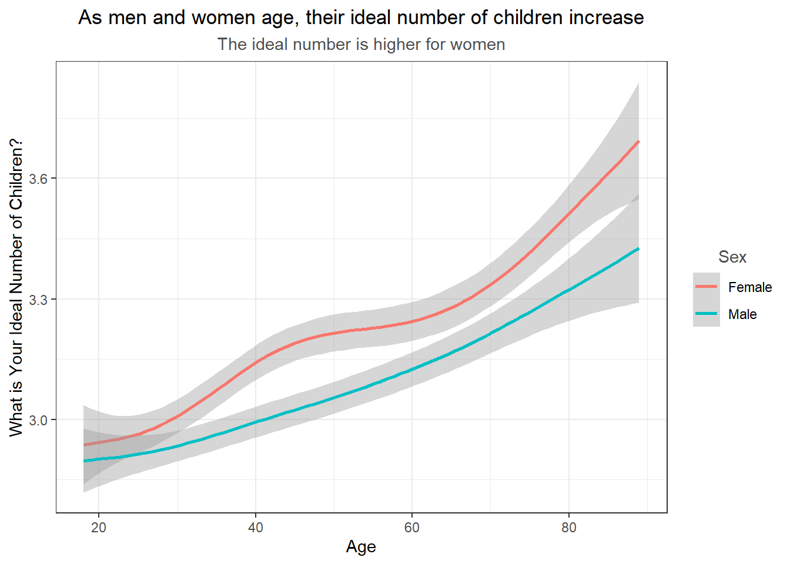
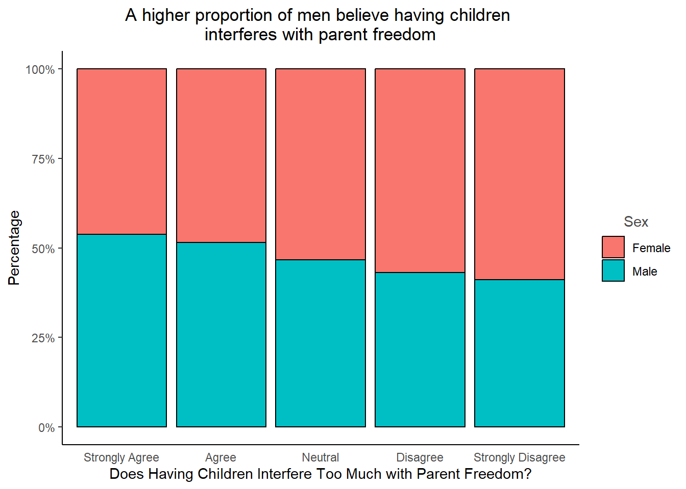
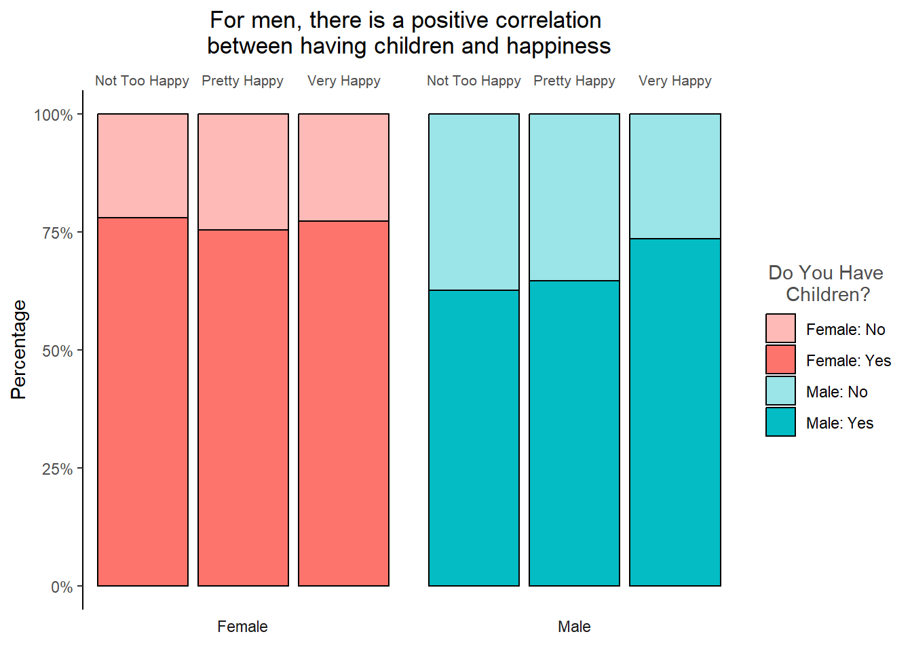

::: {.cell}

```{.r .cell-code}
library(tidyverse)
```

::: {.cell-output .cell-output-stderr}

```
── Attaching core tidyverse packages ──────────────────────── tidyverse 2.0.0 ──
✔ dplyr     1.1.4     ✔ readr     2.1.5
✔ forcats   1.0.0     ✔ stringr   1.5.1
✔ ggplot2   3.5.1     ✔ tibble    3.2.1
✔ lubridate 1.9.3     ✔ tidyr     1.3.1
✔ purrr     1.0.2     
── Conflicts ────────────────────────────────────────── tidyverse_conflicts() ──
✖ dplyr::filter() masks stats::filter()
✖ dplyr::lag()    masks stats::lag()
ℹ Use the conflicted package (<http://conflicted.r-lib.org/>) to force all conflicts to become errors
```


:::

```{.r .cell-code}
library(haven)
```
:::


# How Do Men and Women Differ in Their Attitudes Towards Children?


::: {.cell}

```{.r .cell-code}
GSS <- read_dta("C:/Users/annab/Downloads/GSS_stata/GSS_stata/gss7224_r1.dta")

# age, sex, childs, chldidel, kidnofre, happy, hapmar, 

GSS2 <- GSS %>% 
  select(c(age, sex, childs, chldidel, agekdbrn, kidnofre, happy, 
           hapmar, adoptkid, adoption)) %>% 
  filter(!is.na(sex)) %>% 
  mutate(sex = case_when(sex %in% "1" ~ "Male",
                         sex %in% "2" ~ "Female"))
  
# Ideal Number of Children
ideal <- GSS2 %>% 
  select(c(age, sex, chldidel)) %>% 
  filter(!is.na(chldidel))

ideal2 <- ideal %>% 
  group_by(sex) %>% 
  summarise(average = mean(chldidel))

# Children and Parent Freedom
freedom <- GSS2 %>% 
  select(c(age, sex, kidnofre, childs)) %>% 
  filter(!is.na(kidnofre)) %>% 
  mutate(freedom = case_when(kidnofre %in% "1" ~ "Strongly Agree",
                             kidnofre %in% "2" ~ "Agree",
                             kidnofre %in% "3" ~ "Neutral",
                             kidnofre %in% "4" ~ "Disagree",
                             kidnofre %in% "5" ~ "Strongly Disagree"))

freedom2 <- c("Strongly Agree", "Agree", "Neutral", "Disagree", "Strongly Disagree")

# Children and Parent Happiness
happiness <- GSS2 %>% 
  select(c(age, sex, childs, happy, hapmar)) %>% 
  filter(!is.na(childs)) %>% 
  filter(!is.na(happy)) %>% 
  mutate(happy = case_when(happy %in% "1" ~ "Very Happy",
                           happy %in% "2" ~ "Pretty Happy",
                           happy %in% "3" ~ "Not Too Happy")) %>%
  mutate(children = case_when(childs %in% "0" ~ "No",
                              !childs %in% "0" ~ "Yes"),
         sex_children = paste(sex, children, sep = ": ")) %>% 
  mutate(sex_children = factor(sex_children, levels = c("Female: No", "Female: Yes", "Male: No", "Male: Yes")))

happy2 <- c("Not Too Happy", "Pretty Happy", "Very Happy")
```
:::


Data was gathered from the 2025 version of the General Social Survey by the NORC at the University of Chicago.


### Ideal Number of Children

::: {.cell}

```{.r .cell-code}
ggplot(ideal, aes(x = chldidel, fill = sex)) +
  geom_bar(color = "black",) +
  geom_vline(data = ideal2, aes(xintercept = average), linetype = "dashed", linewidth = .75) +
  geom_text(data = ideal2, 
            aes(x = average, y = 0.15, label = round(average, 2)), 
            inherit.aes = FALSE,
            angle = 90,
            hjust = -2.75,
            vjust = 1.15) +
  facet_wrap(~sex, nrow = 2) +
  labs(title = "The ideal number of children is similar for men and women",
       subtitle = "The average is slightly higher for women",
       x = "Ideal Number of Children",
       y = NULL,
       fill = "Sex") +
  theme_bw() +
  theme(strip.text = element_blank(),
        axis.ticks.x = element_blank(),
        plot.title = element_text(hjust = 0.5),
        plot.subtitle = element_text(hjust = 0.5, color = "gray30"),
        legend.title = element_text(hjust = 0.5, color = "gray30"))
```

::: {.cell-output-display}
{width=672}
:::

```{.r .cell-code}
ggplot(ideal, aes(x = age, y = chldidel, color = sex)) +
  geom_smooth() +
  labs(title = "As men and women age, their ideal number of children increase",
       subtitle = "The ideal number is higher for women",
       x = "Age",
       y = "What is Your Ideal Number of Children?",
       color = "Sex") +
  theme_bw() +
  theme(plot.title = element_text(hjust = 0.5),
        plot.subtitle = element_text(hjust = 0.5, color = "gray30"),
        legend.title = element_text(hjust = 0.5, color = "gray30"))
```

::: {.cell-output .cell-output-stderr}

```
`geom_smooth()` using method = 'gam' and formula = 'y ~ s(x, bs = "cs")'
```


:::

::: {.cell-output-display}
{width=672}
:::
:::


Although the sample size is slightly smaller for men than women, both sexes follow the same distribution for what they think is the ideal number of children. However, the average for females is slightly higher at 3.18. Overall, the most popular number of children is 2, which reflects the current societal trends in the United States. It would be interesting to see how these numbers change over time.

Some insight can be seen into the change over time when looking at the increase in ideal number of children as age increases. Historically, the birth rates in past generations were higher, and it is interesting to see that the mean number of children drops below 3 for participants in their 20s. In earlier generations, it was common to have more children. It is also possible that some older people who chose to not have children or not have very many list a higher number as their ideal because of regret in their old age.

It is also important to note that the wider spread towards the beginning and ends of the lines indicate a lesser degree of confidence in the mean due to a smaller sample size for those age groups.

### Children's Impact on Parent Freedom


::: {.cell}

```{.r .cell-code}
ggplot(freedom, aes(factor(x = freedom, levels = freedom2), fill = sex)) +
  geom_bar(position = "fill", color = "black") +
  labs(title = "A higher proportion of men believe having children \ninterferes with parent freedom",
       x = "Does Having Children Interfere Too Much with Parent Freedom?", 
       y = NULL,
       fill = "Sex") +
  scale_y_continuous(name = "Percentage", labels = scales::percent) +
  theme_classic() +
  theme(panel.border = element_blank(),
        axis.ticks.x = element_blank(),
        plot.title = element_text(hjust = 0.5),
        legend.title = element_text(hjust = 0.5, color = "gray30"))
```

::: {.cell-output-display}
{width=672}
:::
:::


A higher proportion of men strongly agree that children limit parental freedoms, and a higher proportion of women strongly disagree. This is in line with the general stereotypes
that fathers are less involved with their children, and mothers make children a big part of their lives, both of which have evolutionary and cultural reasons behind them. The proportions are closer to 50% than I thought they would be, and this might be explained by the cultural shift in recent decades prioritizing individual freedom more and responsibility to family less.

### Having Children and General Happiness


::: {.cell}

```{.r .cell-code}
pink_blue <- c("Female: No" = "#febab6", "Male: No" = "#9be4e7", "Female: Yes" = "#fc746c", "Male: Yes" = "#04bcc4")


ggplot(happiness, aes(x = happy, fill = sex_children)) +
geom_bar(position = "fill", color = "black")  +
  scale_fill_manual(values = pink_blue) +
  labs(title = "For men, there is a positive correlation \nbetween having children and happiness",
       x = NULL,
       fill = "Do You Have \nChildren?") +
  scale_x_discrete(position = "top") +
  scale_y_continuous(name = "Percentage", labels = scales::percent) +
  theme_classic() +
  facet_grid(~sex, switch = "x") +
  theme(strip.background = element_blank(),
        panel.border = element_blank(),
        axis.ticks.x = element_blank(),
        plot.title = element_text(hjust = 0.5),
        axis.line.x.top = element_blank(),
        axis.text.x.top = element_text(vjust = -1.25, size = 8),
        legend.title = element_text(hjust = 0.5, color = "gray30"))
```

::: {.cell-output-display}
{width=672}
:::
:::


The proportion of women who have children is the same for all levels of happiness, suggesting that women's happiness may not be strongly correlated with whether they have children. There is also a greater percentage of women from this sample who have children than men. Interestingly for men, the greater proportion of men who rated their happiness as Pretty Happy or Very Happy have children. This paints a slightly different picture about the role that children might play in a man's life compared to the previous chart, where more men than women felt that children interfered with parent freedom. 


## Conclusion

There was a larger portion of women in the sample, but men and women followed generally similar patterns in their attitudes towards children. Generally, it seems that women have more positive attitudes towards children, as seen in a higher average for the ideal number of children across all ages, and more disagreement that children interfere with parent freedom. As for levels of happiness, less men reported having children, but there was a greater proportion of men with children reporting happiness. 

These are important topics to research because in recent generations, cultural ideas and expectations around children and parenting have changed from what they've been for hundreds of years. The United States is experiencing higher rates of fatherlessness and single parenting recently than ever before, which impacts child development and economic stability. As birth rate decreases, and attitudes towards having children become less positive, research and data can help us understand some of the causes behind these changes and how to protect children and the family unit. Data can also be used to spread awareness and educate our society about children and parenting.

### AI Disclosure

Gemini Google and ChatGPT were used for a portion of this project for troubleshooting and locating needed functions. I chose to use AI to assist me with this assignment by tutoring me on the strengths of different charts that I was considering using and learning about different functions to style my chart. I chose to use this tool because I couldn't find the functions I needed in the textbook, and I didn't know how to apply them to my specific code. It affected my learning by helping me consider when to use AI for help, and it also provided solutions that I hadn't thought of previously.
